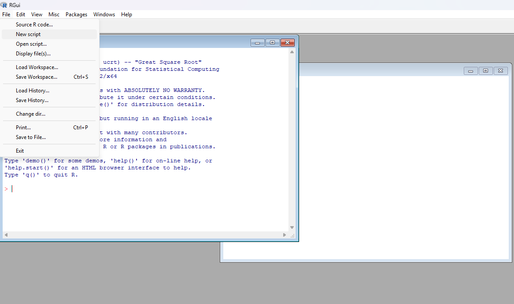
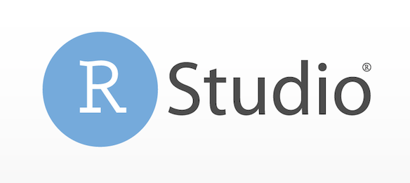
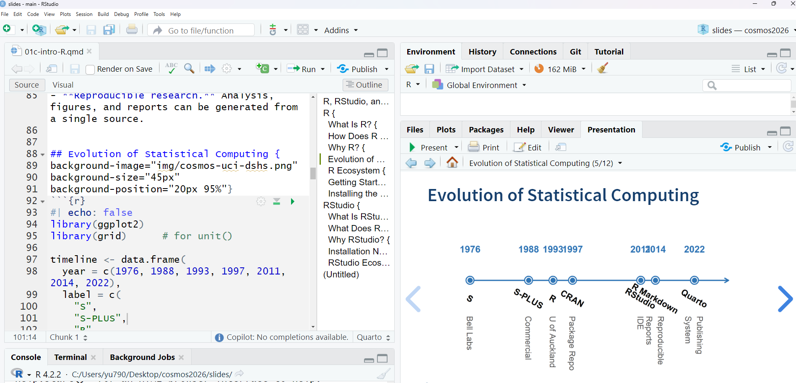
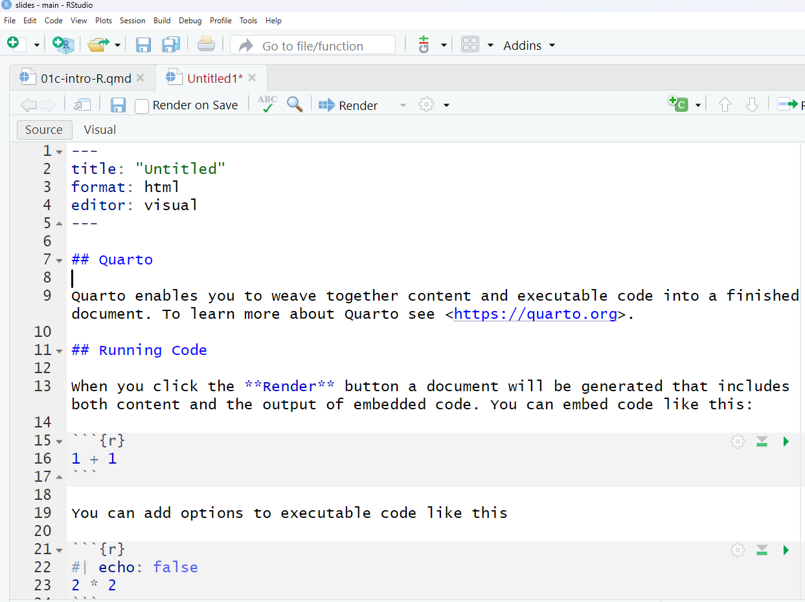

---
format:
  revealjs:
    title-slide: false
    theme: [default, custom1.scss]
    scrollable: true
    self-contained: false
    highlight-style: pygments
    code-line-numbers: true
    code-overflow: wrap
    slideNumber: true
    transition: fade
    progress: true
    controls: true
    ratio: 3:2
    echo: true
    code-fold: true
---

:::::: cover
::::: title-container
::: title-logo

:::

::: title-text
# R, RStudio, and Quarto

Zhaoxia Yu
:::
:::::
::::::

# R {background-image="img/cosmos-uci-dshs.png" background-size="45px" background-position="20px 95%"}

::: {style="text-align:center;"}
{out-width="40%"}
:::

## What Is R? {background-image="img/cosmos-uci-dshs.png" background-size="45px" background-position="20px 95%"}

-   A programming language and software environment for statistical computing and data analysis.
-   Created by statisticians Ross Ihaka and Robert Gentleman at the University of Auckland in the early 1990s.
-   Runs on Windows, macOS, and Linux.
-   Widely used in academia, industry, government, and research around the world.
-   Supports data analysis, visualization, machine learning, and reproducible research through thousands of contributed packages.

## How Does R Look Like? {background-image="img/cosmos-uci-dshs.png" background-size="45px" background-position="20px 95%"}

::: {style="text-align:center;"}
{out-width="10%"}
:::

## Why R? {background-image="img/cosmos-uci-dshs.png" background-size="45px" background-position="20px 95%"}

-   **Designed for statistics.** Created by statisticians for statistical computing and education.
-   **Excellent graphics.** Create publication-quality figures with packages such as **ggplot2**.
-   **Large scientific community.**
    -   [How many packages?]{.fragment data-fragment-index="1"}
    -   [<strong>20,000+</strong> packages on CRAN]{.fragment data-fragment-index="2"}
-   **Open source.** Free to use, free to share, and free to modify.
-   **Reproducible research.** Analysis, figures, and reports can be generated from a single source.

## Evolution of Statistical Computing {background-image="img/cosmos-uci-dshs.png" background-size="45px" background-position="20px 95%"}

```{r}
#| echo: false
library(ggplot2)
library(grid)      # for unit()

timeline <- data.frame(
  year = c(1976, 1988, 1993, 1997, 2011, 2014, 2022),
  label = c(
    "S",
    "S-PLUS",
    "R",
    "CRAN",
    "RStudio",
    "R Markdown",
    "Quarto"
  ),
  info = c(
    "Bell Labs",
    "Commercial",
    "U of Auckland",
    "Package Repo",
    "IDE",
    "Reproducible\nReports",
    "Publishing\nSystem"
  )
)
ggplot(timeline, aes(x = year, y = 0)) +

  ## timeline
  geom_segment(
    aes(x = min(year), xend = max(year) + 4,
        y = 0, yend = 0),
    linewidth = 1.4,
    color = "#2E74B5"
  ) +

  ## arrow
  annotate(
    "segment",
    x = 2025,
    xend = 2029,
    y = 0,
    yend = 0,
    linewidth = 1.4,
    color = "#2E74B5",
    arrow = arrow(length = unit(0.35, "cm"))
  ) +

  ## dots
  geom_point(
    size = 7,
    shape = 21,
    fill = "white",
    color = "#2E74B5",
    stroke = 1.6
  ) +

  geom_point(
    size = 4.8,
    color = "#2E74B5"
  ) +

  ## years
  geom_text(
    aes(label = year),
    y = 0.35,
    size = 7,
    fontface = "bold",
    color = "#2E74B5"
  ) +

  ## milestone
  geom_text(
    aes(label = label),
    y = -0.2,
    size = 6.5,
    angle = -30,
    fontface = "bold"
  ) +

  ## additional information
geom_text(
  aes(label = info),
  y = -0.4,
  angle = -90,
  hjust = 0,
  vjust = 0.5,
  size = 6,
  color = "gray35"
)+

  coord_cartesian(
    xlim = c(1974, 2031),
    ylim = c(-1.0, 0.55),
    clip = "off"
  ) +

  theme_void() +

  #ggtitle("Evolution of Statistical Computing") +

    theme(
    plot.title = element_text(
      size = 26,
      face = "bold",
      hjust = 0.5,
      color = "#1F4E79",
      margin = margin(b = 30)
    ),
    plot.margin = margin(20, 40, 20, 40)
  )
```

## R Ecosystem {background-image="img/cosmos-uci-dshs.png" background-size="45px" background-position="20px 95%"}

R is much more than a programming language.

-   **R**: The programming language
-   **CRAN**: Repository of 20,000+ contributed packages
-   **RStudio**: An integrated development environment (IDE) for R
-   **RMarkdown / Quarto**: publishing systems for reports, slides, websites, and books
-   **Git & GitHub**: Version control and collaboration (optional but highly recommended)

**Today we'll use**: R + RStudio + Quarto

## Getting Started with R {background-image="img/cosmos-uci-dshs.png" background-size="45px" background-position="20px 95%"}

To use R effectively, we need three pieces of software:

1.  **R**: the programming language. The engine.

2.  **RStudio** (recommended). The dashboard.

    -   Where we write and run R code.

3.  **Quarto** (optional but highly recommended). The publishing system.

    -   Where we create reproducible reports and presentations.

Today's workflow: R → RStudio → Quarto

## Installing the Software {background-image="img/cosmos-uci-dshs.png" background-size="45px" background-position="20px 95%"}

Installation order: **R → RStudio → Quarto**

1.  **R**
    -   The programming language.
    -   Everything else depends on it. If R is not installed, RStudio will not work.
2.  **RStudio**
    -   Detects and uses your R installation
3.  **Quarto** (optional)
    -   Works with R and RStudio to create reports, slides, and websites

# RStudio {background-image="img/cosmos-uci-dshs.png" background-size="45px" background-position="20px 95%"}

::: {style="text-align:center;"}
{out-width="40%"}
:::

## What Is RStudio? {background-image="img/cosmos-uci-dshs.png" background-size="45px" background-position="20px 95%"}

-   **RStudio** is an integrated development environment (IDE) for R.

-   Easy to use: write, run, and debug R code in one place.

-   Organized workspace: editor, console, environment, plots, files, and help.

-   Productivity tools: syntax highlighting, code completion, project management, and package management.

-   Works seamlessly with Quarto to create reports, presentations, and websites.

## How Does RStudio Look Like? {background-image="img/cosmos-uci-dshs.png" background-size="45px" background-position="20px 95%"}



## Why RStudio? {background-image="img/cosmos-uci-dshs.png" background-size="45px" background-position="20px 95%"}

-   An integrated development environment (IDE) for writing, running, and debugging R code.

-   User-friendly interface with separate panes for the script editor, console, environment, plots, and files.

-   Improves productivity by providing syntax highlighting, code completion, project management, and package management.

-   Works seamlessly with R and Quarto to create reproducible reports, presentations, and websites.

-   Free, open source, and running on Windows, macOS, and Linux.


## RStudio Ecosystem {background-image="img/cosmos-uci-dshs.png" background-size="45px" background-position="20px 95%"}

RStudio is more than an editor. It integrates with many tools

-   Git & GitHub
-   Quarto
-   Python
-   SQL
-   Jupyter Notebooks

Today we'll focus on **Quarto**, which allows us to combine text, code, figures, and results into a single document.

## From Code to Communication {background-image="img/cosmos-uci-dshs.png" background-size="45px" background-position="20px 95%"}

Writing code is only part of data science. We also need to communicate our work. Quarto allows us to combine

-   text
-   R code
-   tables
-   figures

into one reproducible document.

Next, let's learn **Quarto**.

# Quarto {background-image="img/cosmos-uci-dshs.png" background-size="45px" background-position="20px 95%"}

::: {style="text-align:center;"}
{style="width:40%;"}
:::

## What Is Quarto? {background-image="img/cosmos-uci-dshs.png" background-size="45px" background-position="20px 95%"}

-   **Quarto** is an open-source scientific and technical publishing system.

-   It combines text, code, figures, and results in a single document.

-   It works with multiple programming languages, including R, Python, and Julia.

-   Quarto is a standalone application that can be used with or without R.

-   We will use Quarto together with R and RStudio.

## Why Quarto? {background-image="img/cosmos-uci-dshs.png" background-size="45px" background-position="20px 95%"}

-   Reproducible research: analysis and results are generated from the same source file.

-   Easy to update: changing the data automatically updates tables and figures.

-   Professional output: produce reports, presentations, websites, and books.

-   Works seamlessly with RStudio.

## What Can Quarto Create? {background-image="img/cosmos-uci-dshs.png" background-size="45px" background-position="20px 95%"}

Quarto can generate

-   PDF reports
-   HTML reports
-   Reveal.js presentations
-   Websites
-   Books

These lecture slides were created with Quarto!

## Anatomy of a Quarto Document {background-image="img/cosmos-uci-dshs.png" background-size="45px" background-position="20px 95%"}

```{r}
#| echo: false
#| out-width: 50%
#| fig.align: center


```


## RStudio + Quarto {
background-image="img/cosmos-uci-dshs.png"
background-size="45px"
background-position="20px 95%"}

RStudio makes Quarto easy to use.

- Edit a `.qmd` file.
- Write text using Markdown.
- Add R code.
- Click **Render** to produce the final document.


# Summary {
background-image="img/cosmos-uci-dshs.png"
background-size="45px"
background-position="20px 95%"}

Today we introduced three essential tools:

- **R** computes.
- **RStudio** helps us write and organize code.
- **Quarto** communicates results.

Together they form a modern workflow for data science.


```{r}
knitr::knit_exit()
```
