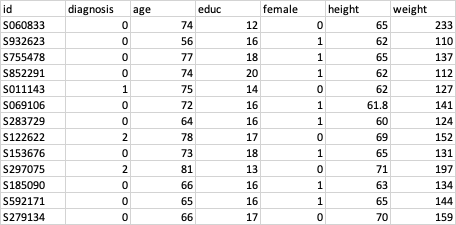
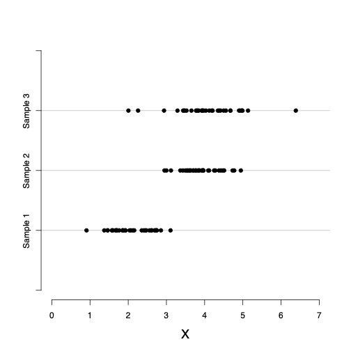
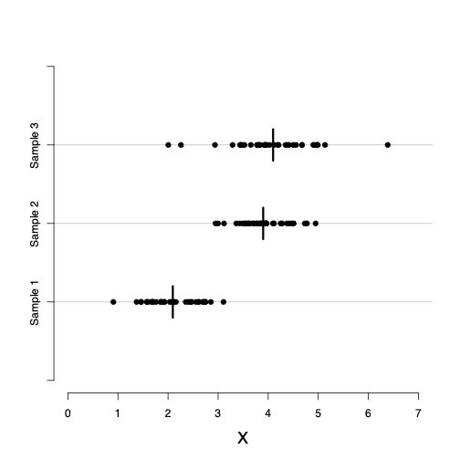
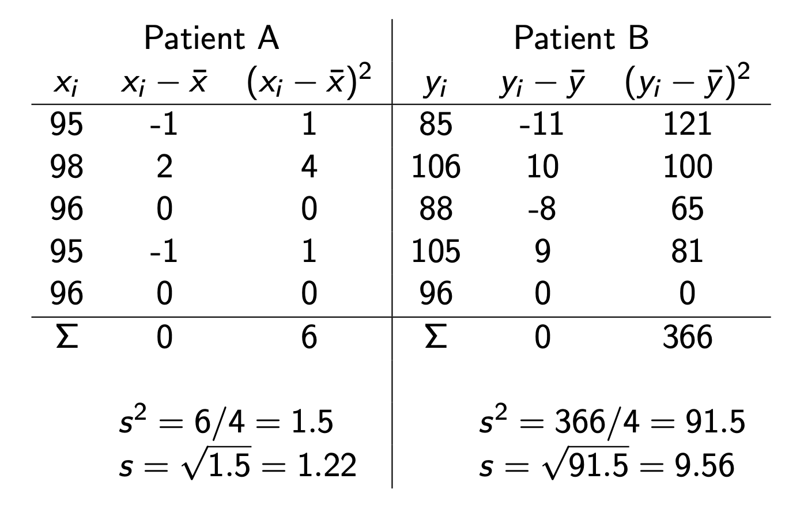
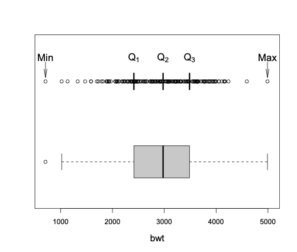
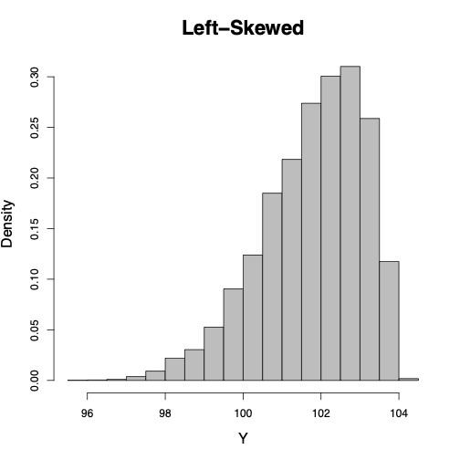
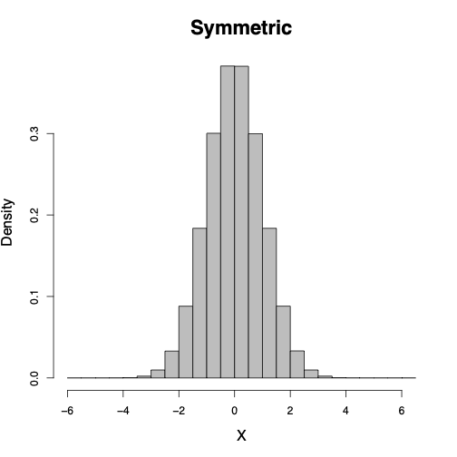
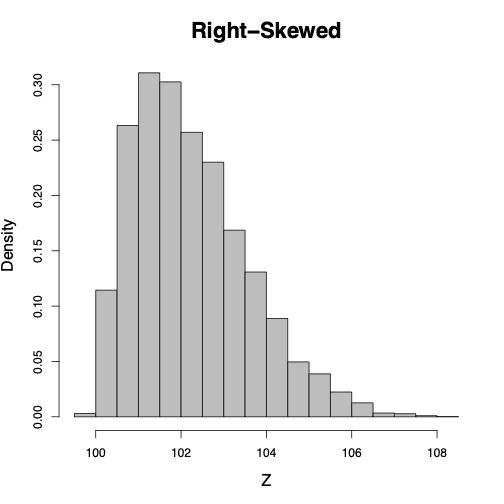

---
format:
  revealjs:
    title-slide: false   
    theme: [default]
#    smaller: true
    chalkboard: true
    scrollable: true
    self-contained: false
    highlight-style: pygments
    code-line-numbers: true
    code-overflow: wrap
    slideNumber: true
    transition: "fade"
    progress: true
    controls: false
    ratio: 3:2
    echo: true
    code-fold: true
    footer: |
      
---

::::: {style="display: flex; align-items: center; justify-content: space-between;"}
::: {style="flex: 0 0 40%;"}

:::

::: {style="flex: 0 0 55%; text-align: left;"}
<h1 style="color: #153e6c; font-size: 2.8em; margin-bottom: 0.5em;">

Describe Data and EDA

</h1>

<p style="color: #153e6c; font-size: 1.8em;">

Zhaoxia Yu

</p>
:::
:::::

## Import Data

```{r}
#| code-fold: false
library(openintro)
library(tidyverse)
library(janitor)

alzheimer_data <- read.csv('data/alzheimer_data.csv') %>% 
  select(id, diagnosis, age, educ, female, height, weight) %>% 
  mutate(diagnosis = as.factor(diagnosis), female = as.factor(female))
```

## Data cycle

```{r}
#| echo: false
knitr::include_graphics('img/data-cycle.png')
```

::: {style="font-size: 50%;"}
Image from Grolemund, G., & Wickham, H. (2018). *R for data science* (CC BY-NC-ND 3.0).
:::

# Alzheimer's Data

## Univariate analysis

We begin by examining one variable at a time.

The goal is to gain a general understanding of each variable by:

-   identifying the possible values,

-   understanding how the values are distributed, and

-   observing how the variable varies across individuals in the sample.

In summary, we are exploring the distribution of each variable.

## Inspect Data using `head()`

```{r}
#| code-fold: false
head(alzheimer_data)
```

## Inspect Data using `tail()`

```{r}
#| code-fold: false
tail(alzheimer_data)
```

## Inspect Data using `glimpse()`

```{r}
#| code-fold: false
glimpse(alzheimer_data)
```

## Check the Number of Columns and Rows

```{r}
#| code-fold: false
ncol(alzheimer_data)
```

```{r}
#| code-fold: false
nrow(alzheimer_data)
```

## Variable Types

```{r}
#| echo: false

```

## NumericalVariables

-   For numerical variables, we can meaningfully compute statistics such as the mean, minimum, and maximum.

-   `age`, `height`, and `weight` are numerical variables because their values are numeric and the numbers have their usual quantitative meaning.

## Categorical variables:

-   `female` may be coded as 0, and 1, but these numbers are simply labels.

-   Such variables are categorical variables, whose values belong to a finite set of categories.

-   Although categorical variables are often encoded using numbers, the numeric codes do not represent quantities and arithmetic operations (e.g., averaging) are not meaningful.

# Categorical Data

## Bar Graphs

-   Bar graphs are commonly used to visualize categorical variables.

-   Each bar represents a category, and its height indicates either:

    -   the frequency (number of observations), or
    -   the relative frequency (proportion of observations)

for that category.

## Bar Graph: Frequency

```{r}
#| code-fold: false
ggplot(alzheimer_data, aes(diagnosis)) +
  geom_bar()
barplot(table(alzheimer_data$diagnosis))
```

## Bar Graph: Relative Frequency

```{r}
#| fig-align: center
prop.table(table(alzheimer_data$diagnosis)) %>% barplot()
```

-   The height of each bar represents the **proportion** of observations in that category.
-   Relative frequencies always sum to **100%** (or 1).

## Useful Statistics

For a **categorical variable**, the most useful summary statistics are:

-   **Frequency**: Number of observations in each category $n_c$.

-   **Relative frequency**: Proportion (or percentage) of observations in each category $p_c = \frac{n_c}{n}$.

-   **Mode**: The category with the highest frequency.

::: callout-tip
For categorical variables, the **mean** and **standard deviation** are **not meaningful**.
:::

# Numerical Data

## Uesful Statistics

-   **Location**: Central tendency (mean, median)
-   **Spread**: Dispersion (range, variance, SD)

```{r}
#| fig-align: center
#| echo: false

```

## Mean

$$\bar{x} = \frac{\sum x_i}{n}$$

```{r}
#| fig-align: center
#| echo: false

```

## Median

::: {style="font-size: 90%;"}
-   The **median** is a measure of the center (location) of a numerical variable.
-   It is **less sensitive to outliers** than the mean.
-   To find the median:
    1.  Sort the observations from smallest to largest.
    2.  Select the middle value.
-   If the sample size (n) is **odd**, the median is the middle observation.
-   If (n) is **even**, the median is the average of the two middle observations.
:::

## Is the Center Enough?

::: {style="font-size: 90%;"}
-   Consider the following blood pressure measurements (mmHg) for two patients:

\begin{aligned}
A:\quad &x=\{95,\,98,\,96,\,95,\,96\}, &
\bar{x}=96,\quad \tilde{x}=96.\\[1ex]
B:\quad &y=\{85,\,106,\,88,\,105,\,96\}, &
\bar{y}=96,\quad \tilde{y}=96.
\end{aligned}

-   Both patients have the **same mean** and **same median**.

-   However, Patient **B** has **much greater variability** in blood pressure.

-   Measures of center alone do not fully describe a distribution. We also need measures of **spread**.
:::

## Standard Deviation and Variance

-   Two common measures of **spread** are the **sample variance** and the **sample standard deviation**.

-   They measure how far the observations tend to be from the sample mean.

-   For each observation $x_i$, compute its deviation from the mean: $x_i-\bar{x}.$

-   The sample variance and standard deviation are calculated from these deviations.

## Variance and Standard Deviation

Sample variance: $$s^2 = \frac{\sum (x_i - \bar{x})^2}{n-1}$$

sample standard deviation (SD): $$s = \sqrt{s^2}$$

## 

```{r}
#| fig-align: center
#| echo: false

```

## Quantiles

-   The **(q) quantile** is also called the **(100q)th percentile**.

-   Examples:

| Quantile | Percentile | Name                |
|:--------:|:----------:|---------------------|
|   0.25   |    25th    | First quartile (Q1) |
|   0.50   |    50th    | Median (Q2)         |
|   0.75   |    75th    | Third quartile (Q3) |

## Quartiles

-   The ordered observations can be divided into **four equal parts** using the **25th, 50th, and 75th percentiles**.

-   These three values are called the **quartiles**:

    -   **Q1 (25th percentile):** First (lower) quartile
    -   **Q2 (50th percentile):** Median
    -   **Q3 (75th percentile):** Third (upper) quartile

-   The distance between **Q1** and **Q3** is called the **interquartile range (IQR)**: $\mathrm{IQR}=Q_3-Q_1.$

## Measures of spread

-   We have learned variance and standard deviation as measures of spread.

-   Two other measures:

    -   Range = Maximum − Minimum
    -   IQR = Q3 − Q1

## Five-Number Summary

-   The **five-number summary**:
    -   Minimum
    -   First quartile (Q1)
    -   Median (Q2)
    -   Third quartile (Q3)
    -   Maximum
-   The five-number summary provides a concise description of the distribution using the **0, 0.25, 0.50, 0.75, and 1 quantiles**.

## Five-Number Summary and Boxplot

```{r}
#| echo: false
#| fig-align: center

```

## Interpretation of Boxplot

-   **Median:** line inside the box

-   **Q1** and **Q3:** bottom and top of the box

-   **IQR:** height of the box $\text{IQR} = Q_3 - Q_1$

-   **Whiskers:** extend to the most extreme observations within **1.5 × IQR** of Q1 and Q3

-   **Outliers:** observations beyond the whiskers, shown as individual points

## Histogram: Frequency or Relative Frequency

-   Histograms provide another useful visual representation of the distribution of a numerical variable.

-   A histogram displays the distribution of a **numerical variable** by grouping observations into intervals (called **bins**).

-   The height of each bar can represent the **frequency**, **relative frequency** $p_c=\frac{n_c}{n}$, or the **percentage** $(100\times p_c)$ of observations in that interval.

## Histogram: Density

-   In statistics, histograms are often drawn using **density** rather than relative frequency.

-   The **density** is the relative frequency per unit interval: $$f_c=\frac{p_c}{w_c},$$

    where $w_c$ is the width of interval $c$.

-   Note that $f_c$ could be greater than 1; it is not a probability, but the area of the bar is a probability. The total area of the histogram is 1.

## Shape of a Histogram

-   The shape of a histogram shows us how the observed values spread around the location.

-   Symmetric around its location: when the densities are \[almost\] the same for any two intervals that are equally distant from the center.

-   Left-skewed: stretched to the right. Example: age at death.

-   Reft-skewed: stretched to the left. Example: house income.

## 

<center></center>

## 

<center></center>

## 

<center></center>

# Alzheimer Data: `age`

## Alzheimer Data: Univariate Analysis of Age

We will use the **age** variable to practice exploratory data analysis (EDA).

Our goals are to answer the following questions:

-   What is the center of the distribution?
-   How much variability is there?
-   What is the shape of the distribution?
-   Are there any unusual observations (outliers)?

## Summary Statistics

```{r}
#| code-fold: false
summary(alzheimer_data$age)
```

-   What is the **minimum** age?
-   What is the **maximum** age?
-   What is the **median** age?
-   What is the **interquartile range (IQR)**?

## Mean and Standard Deviation

```{r}
#| code-fold: false
alzheimer_data %>%
  summarize(
    Mean = mean(age),
    SD = sd(age)
  )
```

-   What does the standard deviation tell us?

## Histogram of Age

```{r}
#| fig-align: center
ggplot(alzheimer_data, aes(age)) +
  geom_histogram(binwidth = 5)
```

-   Is the distribution symmetric or skewed?
-   Are there multiple peaks?

## Boxplot of Age

```{r}
#| fig-align: center
ggplot(alzheimer_data, aes(y = age)) +
  geom_boxplot()
```

-   What is the median age?
-   What is the interquartile range?
-   Are there any potential outliers?

## What Have We Learned?

From the histogram, boxplot, and summary statistics, describe the distribution of **age**.

Consider:

-   Center (mean and median)
-   Spread (SD and IQR)
-   Shape (symmetric or skewed?)
-   Outliers

# Case Study: Alzheimer Data

## Alzheimer Data: Univariate Analysis of `female`

We will use the **female** variable to practice EDA for a **categorical variable**.

Our goals are to answer the following questions:

-   What are the possible categories?
-   How many observations are in each category?
-   What proportion of the sample belongs to each category?
-   Which category is the most common?

## Frequency Table

```{r}
#| code-fold: false
table(alzheimer_data$female)
```

-   What are the two categories?
-   Which category has the larger frequency?

::: callout-tip
### Tip: Understand the Coding

Categorical variables are often stored using **numeric codes**.

For the **female** variable:

-   **0 = Male**
-   **1 = Female**

The numbers are **labels**, not quantities. Always check the coding before interpreting the results.
:::

## Relative Frequency

```{r}
prop.table(table(alzheimer_data$female))
round(100 * prop.table(table(alzheimer_data$female)), 1)
```

-   What proportion of the participants are female?
-   Do the proportions sum to 1?

## Bar Graph

```{r}
#| fig-align: center
ggplot(alzheimer_data, aes(female)) +
  geom_bar() +
  labs(
    x = "Female",
    y = "Frequency"
  )
```

-   Which category has the taller bar?
-   Does the graph agree with the frequency table?

## Bar Graph: Relative Frequency

```{r}
#| fig-align: center
ggplot(alzheimer_data,
       aes(x = female,
           y = after_stat(prop),
           group = 1)) +
  geom_bar() +
  scale_y_continuous(labels = scales::percent) +
  labs(
    x = "Female",
    y = "Relative Frequency"
  )
```

-   Approximately what percentage of participants are female?
-   Is the sample balanced by sex?

## What Have We Learned?

Describe the distribution of **female**.

-   Categories
-   Frequency of each category
-   Relative frequency of each category
-   Most common category (mode)

## EDA workflow depends on the variable type:

| Numerical Variable (Age) | Categorical Variable (Female) |
|--------------------------|-------------------------------|
| Mean, Median             | Frequency, Relative Frequency |
| Standard Deviation, IQR  | Mode                          |
| Histogram                | Bar Graph                     |
| Boxplot                  | Frequency Table               |

# Reporting Summary Statsitics in Scientific Studies

## Typical Summary Table

| Variable        | Summary                       |
|-----------------|-------------------------------|
| **Age (years)** | Mean ± SD (or Median \[IQR\]) |
| **Female**      | *n* (%)                       |

```{r}
library(dplyr)

alzheimer_data %>%
  summarize(
    `Age (years)` =
      sprintf("%.1f ± %.1f",
              mean(age),
              sd(age)),
    Female =
      sprintf("%d (%.1f%%)",
              sum(female == 1),
              100 * mean(female == 1))
  )
```

## 

There are packages to automate the creation of summary tables.

```{r}
library(table1)

table1(~ age + female,
       data = alzheimer_data)
```

## EDA Is More Than a Table 1

A **Table 1** provides a useful summary of the data, but it is only the beginning of exploratory data analysis.

EDA helps us:

-   **Understand the data**
    -   Distribution, center, spread, and outliers
-   **Identify data quality issues**
    -   Missing values
    -   Impossible or unusual values
    -   Coding errors and inconsistencies

## 

-   **Choose appropriate statistical methods**
    -   Is the variable continuous or categorical?
    -   Is the distribution approximately normal?
    -   Are transformations needed?
-   **Generate hypotheses and guide modeling**
    -   Discover interesting patterns
    -   Identify potential relationships between variables
    -   Suggest variables to include in later analyses

**Remember:** Good data analysis begins with understanding the data.
