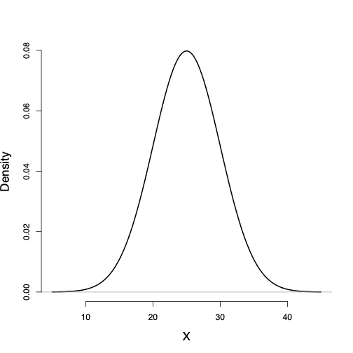
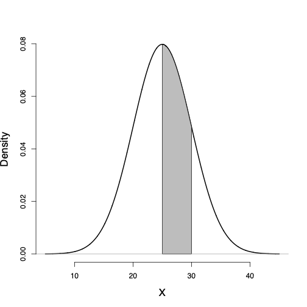
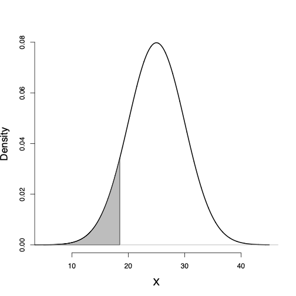
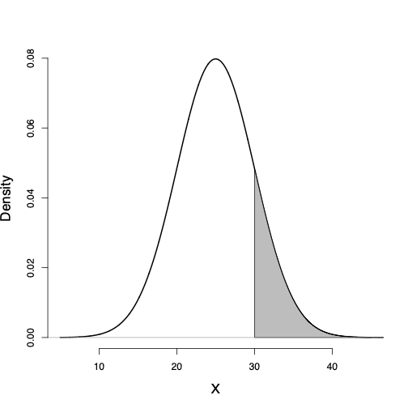
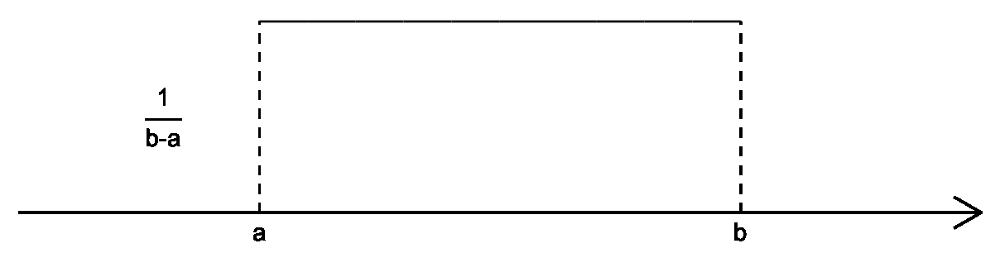
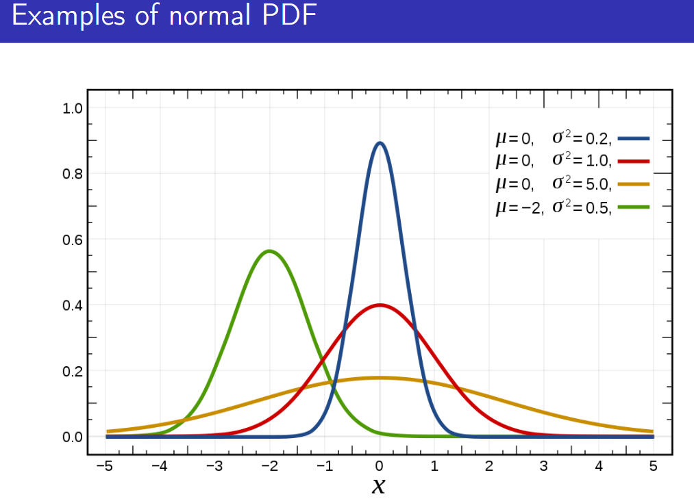
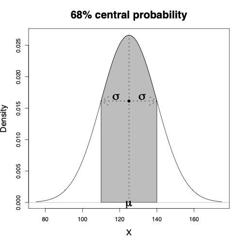
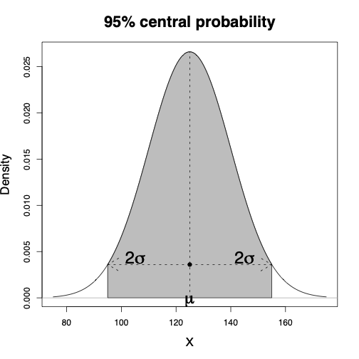
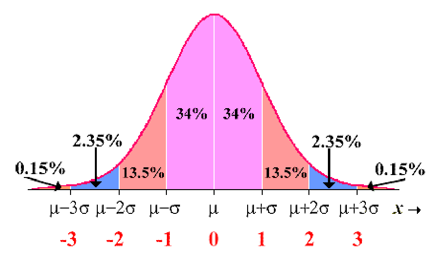

---
format:
  revealjs:
    title-slide: false   
    theme: [default]
#    smaller: true
    chalkboard: true
    scrollable: true
    self-contained: false
    highlight-style: pygments
    code-line-numbers: true
    code-overflow: wrap
    slideNumber: true
    transition: "fade"
    progress: true
    controls: false
    ratio: 3:2
    echo: true
    code-fold: true
    footer: |
      
---

<div style="display: flex; align-items: center; justify-content: space-between;">
<div style="flex: 0 0 40%;">
  
</div>
<div style="flex: 0 0 55%; text-align: left;">
  <h1 style="color: #153e6c; font-size: 2.8em; margin-bottom: 0.5em;">Introduction to Probability</h1>
  <p style="color: #153e6c; font-size: 1.8em;">Zhaoxia Yu</p>
</div>

</div>


## Outline
- Experiment and Sample Space
- Event
- Probability
- Random Variable
- Distribution of a Random Variable

## Introduction
 - We have used plots and summary statistics to learn about the distribution of different variables in the observed data and to investigate their relationships. 
 
 - We now want to __generalize__ our findings to the entire population of interest. 
 
 - However, we almost always remain uncertain about the true distributions and relationships in the population.
 
 - Therefore, when we generalize our findings from a sample to the whole population, we should explicitly specify the extent of our uncertainty.  
 
 - We use probability to measure or quantify uncertainty.


# Experiment and Sample Space

## Experiment
- **Experiment**: any process that produces one outcome from **a set of possible outcomes**. 

- Before performing the experiment, we know the possible outcomes but do not know which one will occur.


## Experiment: Examples
  - roll a die.

  - flip a coin 10 times.

  - measure the resting heart rate of a randomly selected participant.
  
  - randomly select a patient and record their blood type.

## Sample Space

**Sample space**: the set of all possible outcomes of an experiment. Denoted by the symbol $\mathcal S$. Examples:

- For rolling a die, the sample space is $\mathcal S = \{1, 2, 3, 4, 5, 6\}$.

- For flipping a coin 10 times, the sample space is
\begin{aligned}
\mathcal S = \{&
HHHHHHHHHH,\; HHHHHHHHHT,\; \ldots,\\
&
TTTTTTTTTH,\; TTTTTTTTTT
\}.
\end{aligned}


## Sample Space: Examples (cont.)
  - For measuring the resting heart rate of a randomly selected participant, the sample space is $\mathcal S = \{0, 1, 2, \ldots\}$ (assuming heart rate is measured in beats per minute).
  
  - For randomly selecting a patient and recording their blood type, the sample space is $\mathcal S = \{A, B, AB, O\}$. 
  

## Experiment and Sample Space
- An **experiment** is the process we perform. 

- Once the experiment is specified, the **sample space** is determined. It contains all possible outcomes of the experiment. 

- From the sample space, we can define different **events** and **random variables** depending on the question we want to answer.


# Events

## Event: Definition
- An **event** is a subset of the sample space.

- An event occurs if the observed outcome belongs to that subset.


## Example: Roll a Die

Experiment:
- Roll a fair die.

Sample space: $\mathcal S=\{1,2,3,4,5,6\}$


Events:

- $A=\{2,4,6\}$: roll an even number

- $B=\{5,6\}$: roll a number greater than 4

- $C=\{1\}$: roll a 1


## Two Special Events

Every sample space contains two special events.

- **Impossible event**: $\emptyset$
  Contains no outcomes.

- **Certain event**:  $\mathcal S$

  Contains every possible outcome.


## Example

For $\mathcal S=\{1,2,3,4,5,6\}$,

- "Roll a 7" =$\emptyset$.

- "Roll a number between 1 and 6" = $\mathcal S$.


## Set Operations on Events

Suppose

$A=\{2,4,6\},\qquad B=\{4,5,6\}.$

Then

- Union: $A\cup B=\{2,4,5,6\}$

- Intersection: $A\cap B=\{4,6\}$

- Complement:  $A^c=\{1,3,5\}$


## Relationships Between Events

Suppose

$$A=\{2,4,6\},\qquad
B=\{4,6\},\qquad
C=\{1,3,5\}.$$

- $B\subset A$

- $A\cap C=\emptyset$

- $A$ and $C$ are **disjoint** (mutually exclusive)

- $A\cup C=\mathcal S$

- $C=A^c$


# Probability 

## Probability

- A **probability function** assigns a number to each event.

- The probability of an event measures how likely the event is to occur.

- We write the probability of an event $A$ as

$$
P(A).
$$

- A larger probability means the event is more likely to occur.


## Example: A Fair Die

Suppose a fair six-sided die is rolled once.

Sample space:

$$
\mathcal S=\{1,2,3,4,5,6\}.
$$

Since the die is **fair**, each outcome is equally likely.

$$
P(\{1\})=P(\{2\})=\cdots=P(\{6\})=\frac16.
$$

Each outcome has probability $\frac16$.


## Probability of Events

Let

$$
A=\{2,4,6\},
$$

the event that the die shows an even number.

Since $A=\{2\}\cup\{4\}\cup\{6\},$

$$
P(A)
=
P(\{2\})+P(\{4\})+P(\{6\})
=
\frac36
=
\frac12.
$$

The probability of an event is the sum of the probabilities of its outcomes.


## Properties of a Probability Function

A probability function satisfies three basic properties.

1. Nonnegative $P(A)\ge0.$

2. Certain event $P(\mathcal S)=1.$

3. Additivity. If $A$ and $B$ are disjoint,

$$
P(A\cup B)=P(A)+P(B).
$$


## Equally Likely Outcomes

When all outcomes are equally likely,

$$
P(A)
=
\frac{\text{number of outcomes in }A}
{\text{number of outcomes in }\mathcal S}.
$$

### Example

For a fair die,

$$
P(\{2,4,6\})=\frac36=\frac12.
$$

This shortcut applies only when all outcomes are equally likely.


## Joint Probability

The **joint probability** of $A$ and $B$ is

$$
P(A\cap B),
$$

the probability that **both events occur**.


##

Suppose a fair die is rolled once. Let 

- $A=\{2,4,6\}$, the event that the outcome is even, and

- $B=\{4,5,6\}$, the event that the outcome is greater than 3.

Since
$$
A\cap B=\{4,6\},
$$

$$
P(A\cap B)=\frac26=\frac13.
$$


## Marginal vs Joint Probability

The probability of a single event is called its **marginal probability**.

- $P(A)$ is the marginal probability of $A$.
- $P(B)$ is the marginal probability of $B$.

- $P(A\cap B)$ is the joint probability of $A$ and $B$.

Marginal probabilities describe one event at a time, while a joint probability describes two events occurring together.


## Conditional Probability

Suppose we know that event $B$ has occurred. What is the probability that event $A$ also occurs? This is called the **conditional probability** of $A$ given $B$, denoted by

$$
P(A\mid B).
$$

**Definition:** If $P(B)>0$, the conditional probability of $A$ given $B$ is

$$
P(A\mid B)=\frac{P(A\cap B)}{P(B)}.
$$


## 
- The denominator $P(B)$ represents the probability of the condition.
- The numerator $P(A\cap B)$ is the probability that **both** $A$ and $B$ occur.
- Conditional probability restricts our attention to outcomes in event $B$.


## 
Consider rolling a fair die once. Let
$$
A=A=\{2,4,6\},  B=\{4,5,6\}$$

By the definition of $P(A\mid B)$, we have
$$P(A\mid B)
=
\frac{P(A\cap B)}{P(B)}
=
\frac{2/6}{3/6}
=
\frac23.
$$

Conditional probability updates probabilities using additional information.


## Independence

Two events are **independent** if knowing one event occurs does not change the probability of the other.

Equivalently,

$$
P(A\mid B)=P(A).
$$

or

$$
P(A\cap B)=P(A)P(B).
$$


## 
In our example,

$$
P(A)=\frac12, \quad P(A\mid B)=\frac23.
$$

Since

$$
P(A\mid B)\ne P(A),
$$

the events $A$ and $B$ are **dependent**.


## Independent Events

Let $A=\{1,3,5\}, \quad B=\{1,2,3,4\}$

Then,
$$P(A)=\frac36=\frac12, P(B)=\frac46=\frac23, P(A\cap B)=\frac26=\frac13.$$

Since 
$$P(A\cap B)
=
P(A)P(B)
=
\frac12\times\frac23
=
\frac13,$$

the events are **independent**.


## Independent vs. Disjoint Events

| Disjoint | Independent |
|:---|:---|
| Cannot occur together | Can occur together |
| $$A\cap B=\emptyset$$ | $$P(A\cap B)=P(A)P(B)$$ |
| Knowing one occurs tells you the other cannot occur | Knowing one occurs does not change the probability of the other |

## Example (Roll a Fair Die)

Let $A=\{2,4,6\}, \quad
B=\{1,3,5\}.$

- $A$ and $B$ are **disjoint** because $A\cap B=\emptyset.$

- They are **not independent** because

$$
P(A\mid B)=0\ne\frac12=P(A).
$$

> **Key Idea:**  
> Disjoint events are **mutually exclusive**.  
> Independent events **do not influence each other**.


# Caes Study

## Case Study: Blood Type and Rh Factor

Suppose we randomly select one person from a population.

For this person, we observe

- ABO blood type: A, B, AB, or O
- Rh factor: Positive (+) or Negative (−)


## Experiment and Sample Space

**Experiment**

Randomly select one person and determine the person's blood type and Rh factor.

**Sample Space**

$$
\mathcal S=
\{
\text{A+},\text{A−},
\text{B+},\text{B−},
\text{AB+},\text{AB−},
\text{O+},\text{O−}
\}.
$$

The sample space contains eight possible outcomes.


## Events

Examples of events include

- $A=\{\text{A+},\text{A−}\}$

  The person has blood type A.

- $B=\{\text{A+},\text{B+},\text{AB+},\text{O+}\}$

  The person is Rh positive.

- $C=\{\text{O+},\text{O−}\}$

  The person has blood type O.

Each event is a subset of the sample space.


## Operations on Events

Using the previous events,

- Union: $A\cup C$

  The person has blood type A **or** O.

- Intersection: $A\cap B$

  The person has blood type A **and** is Rh positive.

- Complement: $B^c$

  The person is Rh negative.
  
  
## Relationships Between Events

Examples:

- $A\cap C=\emptyset$

  A person cannot have both blood type A and blood type O.

- Therefore, $A$ and $C$ are **disjoint**.

- $A\subset A\cup C$

- $A\cup A^c=\mathcal S$

These relationships hold for any events.


## Probability

<div style="font-size: 0.75em;">

:::: {.columns}

::: {.column width="45%"}

Suppose the blood type distribution in a population is

| Blood Type | Probability |
|:----------:|:-----------:|
| A | 0.42 |
| B | 0.10 |
| AB | 0.04 |
| O | 0.44 |

This is **marginal dsitribution** of blood type.
:::

::: {.column width="55%"}

Recall

- $A$: person has blood type A

- $C$: person has blood type O

Then

- $P(A)=0.42$

- $P(C)=0.44$

Since $A$ and $C$ are disjoint,

$$
P(A\cup C)
=
P(A)+P(C)
=
0.42+0.44
=
0.86.
$$

:::

::::

</div>


## ABO and Rh Factor

- Suppose we also know he Rh factor distribution is

  $$P(\text{Rh+})=0.85,\qquad
  P(\text{Rh−})=0.15.$$

- The ABO and Rh blood group systems are determined by **different genes** and are generally considered **independent**.

- Therefore, the probability of having a particular ABO blood type does not depend on Rh status.


## Joint and Conditional Probability

<div style="font-size: 0.8em;">

Since ABO blood type and Rh factor are independent,

$$
P(\text{A and Rh+})
=
P(\text{A})P(\text{Rh+})
=
0.42\times0.85
=
0.357.
$$

The probability that a randomly selected person has blood type A **and** is Rh positive is 0.357.

Using conditional probability,

$$
P(\text{A}\mid\text{Rh+})
=
\frac{P(\text{A and Rh+})}
     {P(\text{Rh+})}
=
\frac{0.357}{0.85}
=
0.42.
$$

Knowing that a person is Rh positive does **not** change the probability that the person has blood type A.

</div>


#
# Discrete Random Variable

## A Motivating Example

**Experiment**: flip a fair coin 10 times.

### Assumptions

- The coin is fair.
- The 10 flips are independent.

**Question:** What can we say about the outcomes?


## Sample Space

Each outcome is a sequence of 10 heads (H) and tails (T).

Examples:

HHHTHTTTHH

HTHHHTTTHT

TTTTTHHHHH

There are $2^{10}=1024$ possible sequences. Since the coin is fair and the flips are independent,

$$
P(\text{each sequence})=\frac1{2^{10}}=\frac1{1024}.
$$

## Events

An event is a subset of the sample space.

Examples of events:

- $A$: Exactly 4 heads

- $B$: At least 8 heads

- $C$: The first flip is a head

Each event contains many possible sequences.

**Question:** How many sequences belong to event $A$?


## Do We Really Need All 1024 Sequences?

The sample space contains $1024$ possible outcomes.

However, in many applications we do **not** care about the exact sequence. Instead, we ask questions like

- How many heads were observed?

- Was the first flip a head?

- Were there at least 8 heads?

These questions summarize the outcome rather than describing the entire sequence.

## Random Variables

A **random variable** assigns a numerical value to each outcome in the sample space.

Define $X=\text{number of heads in 10 flips}.$

Examples

| Outcome | $X$ |
|:----------------|:--:|
| HHHHHHHHHH | 10 |
| HHHTHTTTHH | 6 |
| TTTTTTTTTT | 0 |
| HTHTHTHTHT | 5 |


## Why Random Variables Help

Instead of studying $1024$ possible sequences, we study only $11$ possible values of $X.$

where $X\in\{0,1,2,\ldots,10\}.$

Random variables simplify probability problems.


## Probability Distribution

Now our goal is to find

$$
P(X=x),
$$

for each possible value $x=0,1,\ldots,10.$

For example,

$$
P(X=4)
$$

is the probability of observing exactly four heads.


## Example

To compute $P(X=4),$ count the number of sequences with exactly four heads.

There are $\binom{10}{4}=210$ such sequences. Therefore,

$$
P(X=4)
=
\frac{\binom{10}{4}}{2^{10}}
=
\frac{210}{1024}
\approx0.205.
$$


## Another Example

Similarly,

$$
P(X=3)
=
\frac{\binom{10}{3}}{2^{10}},
$$

and

$$
P(X=7)
=
\frac{\binom{10}{7}}{2^{10}}.
$$

Notice the pattern.


## A General Formula

For any

$$
x=0,1,\ldots,10,
$$

$$
P(X=x)
=
\frac{\binom{10}{x}}{2^{10}}.
$$

More generally, if the probability of heads is $p,$ then

$$
P(X=x)
=
\binom{10}{x}
p^x
(1-p)^{10-x}.
$$


## Binomial Distribution

A random variable follows a **Binomial distribution** if

- there are a fixed number of trials,
- each trial has two possible outcomes,
- the trials are independent,
- the probability of success is the same for every trial.

##

Notation:

$$
X\sim\text{Binomial}(n,p).
$$

Its **probability mass function** is

$$
P(X=x)
=
\binom{n}{x}
p^x
(1-p)^{n-x},
$$

for $x=0,1,\ldots,n.$


## Does Our Example Follow a Binomial Distribution?

For the coin-flipping experiment,

- Number of trials: $n=10$

- Success: Head

- Probability of success: $p=\frac12$

Therefore,

$$
X\sim\text{Binomial}\left(10,\frac12\right).
$$


## A Special Case: One Trial

The Binomial distribution describes the number of successes in $n$ independent trials.

When $n=14, for example,

- Flip a coin **once**.
- Test whether a patient responds to a treatment.
- Determine whether a person has blood type O.

Each experiment has only two possible outcomes:

- Success
- Failure


## Bernoulli Distribution

A **Bernoulli random variable** records the outcome of a single trial.

Define

$$
X=
\begin{cases}
1, & \text{if success},\\
0, & \text{if failure.}
\end{cases}
$$

Denote $p=P(X=1)$, then

$$
P(X=0)=1-p.
$$

We write

$$
X\sim\text{Bernoulli}(p).
$$


## Bernoulli Distribution

The **probability mass function (pmf)** is

$$
P(X=x)
=
p^x(1-p)^{1-x},
\qquad
x=0,1.
$$

Equivalently,

| $x$ | Probability |
|:---:|:-----------:|
| 0 | $1-p$ |
| 1 | $p$ |


## Example

Randomly select one person.

Define

$$
X=
\begin{cases}
1, & \text{if the person has blood type O},\\
0, & \text{otherwise.}
\end{cases}
$$

Then

$$
X\sim\text{Bernoulli}(p),
$$

where

$$
p=P(\text{blood type O}).
$$

The value of $p$ depends on the population being studied.


## From Experiment to Random Variable

::: {.column width="60%"}

- **Experiment:** The process we perform.

- **Sample Space ($\mathcal{S}$):**
  All possible outcomes of the experiment.

- **Events:**
  Subsets of the sample space.

- **Random Variables:**
  Numerical functions defined on the sample space.

:::

::: {.column width="40%"}

```{mermaid}
flowchart TD
    A(Experiment)
    B(Sample Space)
    C(Events)
    D(Random Variables)

    A --> B
    B --> C
    B --> D
```
:::


# Discrete vs. Continuous Random Variables

## Discrete Random Variables

- Take a **countable** set of possible values.
- Typically represent **counts** or **categories**.
- Examples:
  - Number of heads in 10 coin flips (Binomial)
  - Whether a person has blood type O (Bernoulli)
  - Number of patients visiting an emergency room in one day


## Continuous Random Variables

- Take **any value within an interval** of the real line.
- Used to measure quantities rather than count them.
- Examples:
  - Height
  - Weight
  - Body Mass Index (BMI)
  - Blood pressure

For a continuous random variable, between any two possible values, there are infinitely many other possible values.

## Probability distributions

- The probability distribution of a random variable provides the required
information to find the probability of its possible values.

- The probability distributions discussed here are characterized by one or more
__parameters__.

- The parameters of probability distributions we assume for random variables are usually unknown.


## Discrete probability distributions

- For discrete random variables, the probability distribution is fully
defined by its **probability mass function** (pmf). 

- This is a function that specifies the probability of each possible value within the
range of random variable. 

- For the genotype example, the pmf of the
random variable $X$ is

$$P(X=x) = \left\{ \begin{array}{l@{\quad}l}
0.49 &  \mbox{for } x=0, \\
0.42 &  \mbox{for } x=1, \\
0.09 &  \mbox{for } x=2.
\end{array} \right.$$


## Discrete uniform distribution

- One of the most straightforward, yet useful distributions, is the one that assigns the same probability, regardless of the value. 

- For that reason, it is called __uniform probability distribution__. 

- A _discrete_ uniform distribution can be written as follow

$$P(X=x) = \left\{ \begin{array}{l@{\quad}l}
\frac{1}{k}  & x=1,...,k  \\
0 & \mbox{otherwise} \\
\end{array} \right.$$

## Continuous probability distributions

- For discrete random variables, the pmf provides the probability of each
possible value. 

- For continuous random variables, the number of possible
values is uncountable, and the probability of any specific value is
zero. 

- For these variables, we are usually interested in the probability that the value of
the random variable is within a specific interval from $x_{1}$ to
$x_{2}$; we show this probability as $P(x_{1} < X \le x_{2})$. 


## Probability density function

- For continuous random variables, we use **probability density functions** (pdf) to specify the distribution. Using the pdf, we can obtain the probability of any interval. 
<!--
```{r, echo=FALSE,out.width='25%',out.height='60%',fig.align='center',fig.cap='Probability density function for BMI'}

```
-->


## Probability density function

- The total area under the probability density curve is 1. 

- The curve (and its corresponding function) gives the probability of the random variable falling within an interval. 

- This probability is equal to the area under the probability density curve over the interval.
```{r, echo=FALSE,out.width='25%',out.height='60%',fig.align='center'}

```


## Lower tail probability
- the probability of observing
values less than or equal to a specific value $x$, is called the lower
tail probability and is denoted as $P(X \le x)$. 

```{r, echo=FALSE,out.width='25%',out.height='60%',fig.align='center'}

```


## Upper tail probability

- The probability of observing values greater than $x$, $P(X > x)$, is called the upper tail probability and is found by
measuring the area under the curve to the right of $x$. 

```{r, echo=FALSE,out.width='25%',out.height='60%',fig.align='center'}

```


## Probability of intervals

- The probability of any interval from $x_{1}$ to $x_{2}$, where $x_{1} < x_{2}$, can be obtained using the corresponding lower tail probabilities for these two points as follows:
$$\begin{equation*}
P(x_1 < X \le x_2) = P(X \le x_2) - P(X \le x_1).
\end{equation*}$$

- For example, the probability of a BMI between 25 and 30 is
$$\begin{equation*}
P(25 < X \le 30) = P(X \le 30) - P(X \le 25).
\end{equation*}$$


## Continuous Uniform Distribution

- We previously saw discrete uniform distribution; we now discuss its continuous version. 

- Let $a$ and $b$ be two real numbers, so that $a<b$. The following the pdf of a __continuous uniform distribution__: 

$$f(x) = \left\{ \begin{array}{l@{\quad}l}
\frac{1}{b-a}  & a<x<b  \\
0 & \mbox{otherwise} \\
\end{array} \right.$$


```{r, echo=FALSE,out.width='50%',out.height='60%',fig.align='center'}

```


## A PDF Is **Not** a Probability Function

Suppose $X\sim\text{Uniform}(0,0.5).$

Then

$$
f(x)=
\begin{cases}
2, & 0<x<0.5,\\
0, & \text{otherwise}.
\end{cases}
$$

Notice that $f(0.25)=2.$ So $f(0.25)$ **cannot** be the probability that $X=0.25$.

In fact, $P(X=0.25)=0.$

**A PDF gives the density of probability, not the probability itself.**


## Probability Is the Area Under the PDF

For $X\sim\text{Uniform}(0,0.5),$

the probability of an interval is the **area under the PDF**.

For example,

$$
P(0.10<X<0.30)
=
2\times(0.30-0.10)
=
0.40.
$$


- the **height** of the PDF is 2,
- the **probability** is the area between 0.10 and 0.30, which is a rectangle with width $0.30-0.10=0.20$ and height $2$. So the area is: $2\times0.20=0.40.$

## 

**Key idea:**

- For a discrete random variable, probability is assigned to individual values.
- For a continuous random variable, probability is assigned to intervals.

## Normal distribution

- Consider the probability distribution function and its corresponding probability density curve we assumed for BMI in the above example. 

- This distribution is known as **normal** distribution, which is one of the most widely used distributions for continuous random variables. 

- Random variables with this distribution (or very close to it) occur often in nature.


## Normal distribution

- A **normal distribution** and its corresponding pdf are fully specified by the mean (usually denoted as $\mu$) and variance (usually denoted as $\sigma^2$): 

$$N(\mu, \sigma^2)$$ 

- $N(0, 1)$ is called the **standard normal distribution**.


## Normal Distributions

```{r, echo=FALSE,out.width='65%',fig.align='center'}

```


## The 68-95-99.7% rule

- The 68--95--99.7% rule for normal distributions specifies that

  + 68% of values fall within 1 standard deviation of the mean

  + 95% of values fall within 2 standard deviations of the mean

  + 99.7% of values fall within 3 standard deviations of the mean


## Normal Distribution

```{r, echo=FALSE,out.width='40%',out.height='30%',fig.show='hold',fig.align='center'}

```


## Normal Distribution

```{r, echo=FALSE,out.width='40%',out.height='49%',fig.show='hold',fig.align='center'}

```


## The 68-95-99.7% rule
```{r, echo=FALSE,out.width='75%',fig.align='center'}

```
 

## Practice
- Suppose $Z\sim N(0,1)$. 
-  $P(Z>1)=0.135+0.0235+0.0015=0.16$.
-  $P(Z<1)=1-P(Z>1)=1-0.16=0.84$
- $P(Z<-1)=0.135+0.0235+0.0015=0.16$.
-  $P(-1 < Z < 1)=P(Z<1)-P(Z<-1)=0.68$


## The Standard Normal Distribution

- If $X\sim N(\mu, \sigma)$, we can standardize in the following way
$$Z=\frac{X-\mu}{\sigma},$$
where $Z\sim N(0,1)$.


## Student's t-distribution

Another continuous probability distribution that is used very often in
statistics is the __Student's__ $t$-__distribution__ or
simply the $t$-distribution.


```{r, echo=FALSE,out.width='35%',out.height='35%',fig.show='hold',fig.align='center'}
knitr::include_graphics("img/standNormT.png")
```


# Additional Example
## Going Further: Genotype vs. Blood Type

The **ABO blood type** is determined by a person's **genotype**.

Each person inherits one allele from the mother, and one allele from the father.

There are three possible alleles: A, B, and O.


##

The six possible genotypes are

| Genotype | Blood Type |
|:---------:|:----------:|
| AA | A |
| AO | A |
| BB | B |
| BO | B |
| AB | AB |
| OO | O |

**Observation:** Blood type A can arise from two different genotypes (AA or AO).


## A Compatible Genotype Distribution

Suppose the genotype distribution is

| Genotype | Probability |
|:---------:|:-----------:|
| AA | 0.12 |
| AO | 0.30 |
| BB | 0.03 |
| BO | 0.07 |
| AB | 0.04 |
| OO | 0.44 |


## 

The genotype distribution gives the blood type distribution

| Blood Type | Probability |
|:----------:|:-----------:|
| A | 0.42 |
| B | 0.10 |
| AB | 0.04 |
| O | 0.44 |

because

- $P(\text{A})=P(\text{AA})+P(\text{AO})=0.42$

- $P(\text{B})=P(\text{BB})+P(\text{BO})=0.10$

## Conditional Probability

Suppose a randomly selected person has blood type A.

What is the probability that the genotype is AO?

Using conditional probability,

$$
P(\text{AO}\mid\text{A})
=
\frac{P(\text{AO})}{P(\text{A})}
=
\frac{0.30}{0.42}
=
0.714.
$$

Similarly,

$$
P(\text{AA}\mid\text{A})
=
\frac{0.12}{0.42}
=
0.286.
$$


## Why Does This Matter?

Suppose two people both have blood type A.

- Person 1 may have genotype AA.
- Person 2 may have genotype AO.

Although they have the same blood type,

their children may inherit different blood types.

Genotype contains more information than blood type.


## Take-Home Message

This case study illustrates several important ideas.

- An experiment defines a sample space.

- Events are subsets of the sample space.

- Probabilities quantify uncertainty.

- Conditional probability incorporates additional information.

- Sometimes what we observe (blood type) does not uniquely determine the underlying state (genotype).

This is a common theme in data science and biomedical research.
