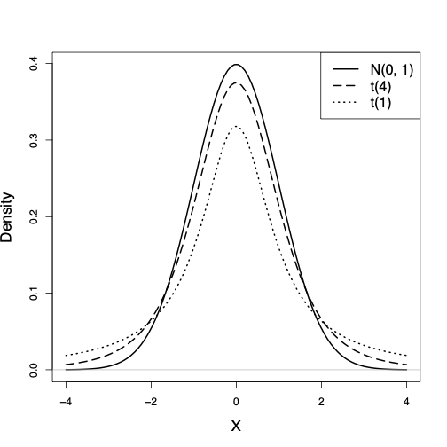

---
format:
  revealjs:
    title-slide: false   
    theme: [default]
#    smaller: true
    chalkboard: true
    scrollable: true
    self-contained: false
    highlight-style: pygments
    code-line-numbers: true
    code-overflow: wrap
    slideNumber: true
    transition: "fade"
    progress: true
    controls: false
    ratio: 3:2
    echo: true
    code-fold: true
    footer: |
      
---

<div style="display: flex; align-items: center; justify-content: space-between;">
<div style="flex: 0 0 40%;">
  
</div>
<div style="flex: 0 0 55%; text-align: left;">
  <h1 style="color: #153e6c; font-size: 2.8em; margin-bottom: 0.5em;">Estimation</h1>
  <p style="color: #153e6c; font-size: 1.8em;">Zhaoxia Yu</p>
</div>

</div>


## Outline:  Data to Statistical Inference

- Point estimation
- Sampling variability
- The sampling distribution
- Standard error
- Margin of error
- Confidence intervals
- How sample size affects precision
- Three examples

# Introduction 

## The General Problem of Estimation

Suppose we want to know something about a large population. Examples:

- What percentage of people have Type O blood?
- What is the mean blood pressure of adults in the U.S.?
- What is the average daily screen time of teenagers?

::: {.callout-note}
The quantity we want to know is called a **population parameter**.

Unfortunately, we usually do **not** have data on the entire population.
:::

## We Rarely Observe the Entire Population

Instead of measuring everyone,

- we collect a **sample**.

- Use the sample to estimate the population parameter.

- Because different samples produce different estimates,

**uncertainty is unavoidable.**


# Example 0: The Ideal Situation

## Example 0: Estimate $\mu$ from a Normal Population $N(\mu, \sigma^2)$

Suppose $X_1,\ldots,X_n \overset{iid}{\sim} N(\mu,\sigma^2),$ where

- the population mean $\mu$ is **unknown**;
- the population standard deviation $\sigma$ is **known**.

**Goal**

Estimate the unknown population mean $mu$.


## Point Estimation

A natural estimate of the population mean is the sample mean

$$
\bar X=\frac1n\sum_{i=1}^n X_i.
$$

It can be shown that $E(\bar X)=\mu.$

Thus, on average, the sample mean equals the population mean.

We call $\boxed{\bar X}$ the **point estimate** of \(\mu\).


## Sampling Distribution of $\bar X$

Since $X_i\sim N(\mu,\sigma^2),$

the sample mean also follows a normal distribution:

$$
\boxed{
\bar X\sim
N\left(
\mu,\,
\frac{\sigma^2}{n}
\right)
}
$$

Notice that

- Center: $\mu$
- Standard deviation: $\frac{\sigma}{\sqrt n}.$ The spread becomes smaller as the sample size increases.


## Standardization

Subtract the mean and divide by the standard deviation:

$$
Z=
\frac{\bar X-\mu}
{\sigma/\sqrt n}.
$$

Then $$Z\sim N(0,1).$$


## Critical Values Based on $N(0,1)$

- The **68–95–99.7 rule** tells us that

$$
P(-2<Z<2)\approx0.95.
$$


- More accurately,

$$
P(-1.96<Z<1.96)\approx0.95.
$$

## About the 68-95-99.7 Rule

- The exact critical value is close to 1.96, which is the 97.5th percentile of the standard normal distribution. It is often denoted by 

$$z_{0.975} = 1.96.$$

- In R, we can find it by running `qnorm(0.975)`.


## Critical values Based on $N(0,1)$

```{r}
#| echo: false
library(ggplot2)

# Data for the normal curve
x <- seq(-4, 4, length.out = 1000)
df <- data.frame(
  x = x,
  y = dnorm(x)
)

# Central 95%
df95 <- subset(df, x >= -1.96 & x <= 1.96)

ggplot(df, aes(x, y)) +
  geom_line(linewidth = 1) +
  geom_area(
    data = df95,
    fill = "skyblue",
    alpha = 0.6
  ) +
  geom_vline(
    xintercept = c(-1.96, 1.96),
    linetype = "dashed",
    color = "red"
  ) +
  annotate(
    "text",
    x = c(-1.96, 1.96),
    y = 0.03,
    label = c("-1.96", "1.96"),
    color = "red",
    vjust = -0.5,
    size = 5
  ) +
  annotate(
    "text",
    x = 0,
    y = 0.22,
    label = "95%",
    size = 7
  ) +
  annotate(
    "text",
    x = -2.8,
    y = 0.02,
    label = "2.5%",
    size = 5
  ) +
  annotate(
    "text",
    x = 2.8,
    y = 0.02,
    label = "2.5%",
    size = 5
  ) +
  labs(
    x = "",
    y = "Density"
  ) +
  theme_classic(base_size = 16)
```

## A 95% Confidence Interval with known $\sigma$

Rearranging the inequality gives

$$
P\left(
\bar X-
z_{0.975}\frac{\sigma}{\sqrt n}
<
\mu
<
\bar X+
z_{0.975}\frac{\sigma}{\sqrt n}
\right)
=0.95.
$$

Thus, a 95% confidence interval for $\mu$ is

$$
\boxed{
\bar X
\pm
z_{0.975}\frac{\sigma}{\sqrt n}
}
$$


## A $(1-\alpha)100\%$ Confidence Interval with known $\sigma$

- In general, a \((1-\alpha)100\%\) confidence interval for \(\mu\) is

$$\bar X \pm z_{1-\alpha/2}\frac{\sigma}{\sqrt n}.$$

- One issue is the $\sigma$ is usually unknown in practice. 


## In Practice

Because the population standard deviation $\sigma$ is usually unknown, we need to

- estimate $\sigma$ using the sample standard deviation $s$;
- replace the normal critical value 1.96 by a **$t$-critical value**.

The resulting 95% confidence interval is

$$
\boxed{
\bar X
\pm
t_{0.975,n-1}
\frac{s}{\sqrt n}
}
$$


## Standard Error vs. Margin of Error

- The **standard error (SE)** is the estimated standard deviation of a point estimate. For the sample mean,

$$
s.e.(\bar X)=\frac{s}{\sqrt n}.
$$

- The **margin of error (ME)** equals the critical value times the standard error. For a 95% confidence interval,

$$
ME=t_{0.975,n-1}\frac{s}{\sqrt n}
=t_{0.975,n-1}s.e.(\bar X).
$$

- The margin of error is the **half-width** of the confidence interval.


## Comparing Normal and $t$ Critical Values

The critical value depends on the **confidence level**, and the **degrees of freedom** (\(df=n-1\)) for the \(t\)-distribution.

| Sample Size \(n\) | \(df\) | 90% | 95% | 99% |
|:-----------------:|:------:|----:|----:|----:|
| Normal (\(z\)) | \(\infty\) | 1.645 | 1.960 | 2.576 |
| 5 | 4 | 2.132 | 2.776 | 4.604 |
| 10 | 9 | 1.833 | 2.262 | 3.250 |
| 20 | 19 | 1.729 | 2.093 | 2.861 |
| 50 | 49 | 1.677 | 2.010 | 2.680 |
| 100 | 99 | 1.660 | 1.984 | 2.626 |

```{r}
n <- c(5, 10, 20, 50, 100)
df <- n - 1

tab <- data.frame(
  n = c(Inf, n),
  df = c(Inf, df),
  `90%` = c(qnorm(0.95), qt(0.95, df)),
  `95%` = c(qnorm(0.975), qt(0.975, df)),
  `99%` = c(qnorm(0.995), qt(0.995, df))
)

round(tab, 3)
```


## What do you notice?

- Higher confidence levels require **larger critical values**, resulting in **wider confidence intervals**.

- For the same confidence level, **\(t\)-critical values are always larger** than the corresponding \(z\)-critical values.

- As the sample size increases, the \(t\)-critical values get closer to the \(z\)-critical values.


## t vs $N(0,1)$ 

```{r, echo=FALSE,out.width='50%',out.height='50%',fig.show='hold',fig.align='center'}

```


## t vs $N(0,1)$

- When $\sigma$ is known, we use the critical value from the standard normal distribution \(N(0,1)\).

- When $\sigma$ is unknown, 
  - we first estimate it with the sample standard deviation $s$, and 
  - we then use the critical value from the \(t\)-distribution with \(n-1\) degrees of freedom.
  - Because estimating $\sigma$ introduces additional uncertainty, the \(t\)-critical value is larger than the corresponding \(z\)-critical value.
  - Correspondingly, the confidence interval is wider when $\sigma$ is unknown.


## Example 0: Summary

- Suppose he population follows $X\sim N(2,5).$

- $\bar X_n$ also follows a normal distribution. Compare $\bar X_{20}$ and $\bar X_{100}$.

```{r}
#| fig-align: center

set.seed(20260709)

B <- 10000

# Population
x <- rnorm(100000, mean = 2, sd = sqrt(5))

# Sampling distributions
xbar20 <- replicate(B, mean(rnorm(20, mean = 2, sd = sqrt(5))))
xbar100 <- replicate(B, mean(rnorm(100, mean = 2, sd = sqrt(5))))

par(mfrow = c(1,3))

hist(x,
     probability = TRUE,
     breaks = 40,
     main = "Population",
     xlab = "X",
     xlim = c(-6,10))

hist(xbar20,
     probability = TRUE,
     breaks = 40,
     main = expression(bar(X)[20]),
     xlab = expression(bar(X)),
     xlim = c(-6,10))

hist(xbar100,
     probability = TRUE,
     breaks = 40,
     main = expression(bar(X)[100]),
     xlab = expression(bar(X)),
     xlim = c(-6,10))
```


## Example 0: Summary 
- In practice, $\sigma$ is unknown and needs to replaced by $s$. This substitution introduces extra uncertainty. 

- Therefore, t distribution is a better choice. 


#


# Example 1: Population Mean $\mu$

## 
- In Example 0, we assume that the population distribution is normal.

- In practice, we often do not know the population distribution.

- In some situations, based on histograms or other visualizations, we may feel that the distribution is approximately normal.

## Height of Female in Alzheimer's Disease Dataset

```{r}
#| warn=FALSE, message=FALSE

library(tidyverse)

alzheimer_data <- read.csv("https://raw.githubusercontent.com/COSMOS-DataScience/slides/refs/heads/main/data/alzheimer_data.csv", head=T)%>% 
  select(id, diagnosis, age, educ, female, height, weight) %>% 
  mutate(diagnosis = as.factor(diagnosis), female = as.factor(female))

# Heights of female participants
f_height = alzheimer_data %>%
  filter(female == 1) %>%
  pull(height)

# histogram height of female
hist(f_height)
```


## Point Estimate and a 95% Confidence Interval for Mean Height of Females

- Use `t.test`
```{r}
# Point estimate
mean(f_height)

# 95% confidence interval
t.test(f_height)$conf.int
```

- Use the formula we derived:
```{r}
n  <- length(f_height)
xbar <- mean(f_height)
s <- sd(f_height)

ME <- qt(0.975, df = n - 1) * s / sqrt(n)

ME 
c(Lower = xbar - ME,
  Upper = xbar + ME)
```


## Results

- What is the estimated mean height? 63.4776
- What is the margin of error? 0.1381925
- Is the confidence interval symmetric about the point estimate? (63.33941 63.61579)

- We typically round the results. For example, 
  - estimate: 63.5 in
  - margin of error: 0.14 in
  - confidence interval: (63.3, 63.6) in


## Interpreting a 95% Confidence Interval

Using the Alzheimer's data set, we found that 

$$(63.3, 63.6) \text{ in}$$

### Correct Interpretation

We are **95% confident** that the true mean height of all female participants lies between **63.3 in** and **63.6 in**.

## What does "95% confident" mean?

If we repeatedly collected random samples of the same size and constructed a 95% confidence interval from each sample,

- about **95% of the intervals** would contain the true population mean;
- about **5% of the intervals** would miss the true population mean.

The confidence level refers to the **method**, not to this particular interval. This will be clear when we look at the next example.


## Example 1: Summary

- Suppose the population is not normal, e.g., skewed.

- Although the population is not normal, the sampling distribution of $\bar X_n$ becomes approximately normal as the sample size increases.

```{r}
#| fig-align: center

set.seed(20260709)

B <- 10000

# Population
x <- rgamma(100000, shape = 2, scale = 1)

# Sampling distributions
xbar20 <- replicate(B, mean(rgamma(20, shape = 2, scale = 1)))
xbar100 <- replicate(B, mean(rgamma(100, shape = 2, scale = 1)))

par(mfrow = c(1,3))

hist(x,
     probability = TRUE,
     breaks = 40,
     main = "Population",
     xlab = "X")

hist(xbar20,
     probability = TRUE,
     breaks = 40,
     main = expression(bar(X)[20]),
     xlab = expression(bar(X)))

hist(xbar100,
     probability = TRUE,
     breaks = 40,
     main = expression(bar(X)[100]),
     xlab = expression(bar(X)))
```


#

# Example 2: Proportion $p$

## Activity: Estimating an Unknown Probability

Suppose everyone is studying **the same coin**.

- The probability of heads is unknown.
- Your goal is to estimate this probability.
- The parameter of interest is denoted by $p$. 
- An estimator is denoted by $\hat p$ (pronounced "p-hat").
- If we flip a coin $n$ times, denote the result of each by $X_i$, where $X_i=1$ if the $i$th flip is heads and $X_i=0$ if tails. Then 

$$\hat p = \frac{1}{n}\sum_{i=1}^{n}X_i$$


## Simulation 1: Flip a Coin 10 Times
- Each student will "flip" (in silicon) a coin **10** times and record the number of heads by running  following code. 

- Report what the value of `p_hat` is.

- 29 experiments were conducted, each with a  random seed to generate a sample.

##

- Everyone uses the same hidden probability.  generate their sample.
```{r}
#| echo: true
#| code-fold: false
#| eval: false

# Everyone uses the same hidden probability
set.seed(20260706)
p <- runif(1)
```

- But each student has a different random seed to generate their sample. To do that, replace 111111 with your birth date.

```{r}
#| echo: true
#| code-fold: false
#| eval: false

# replace 111111 with your birth date
set.seed(111111)

x <- rbinom(n=10, 1, p)
p_hat_sim1 <- mean(x)

p_hat_sim1

n <- 10

# Estimated standard errors
se <- sqrt(p_hat_sim1 * (1 - p_hat_sim1) / n)

# Margin of error
ME <- 1.96 * se

# Confidence intervals
lower <- p_hat_sim1 - ME
upper <- p_hat_sim1 + ME
lower
upper

```


## Simulation 1: Results

- I mimic the 29 experiments by running the following code.

```{r}
#| fig-align: "center"
set.seed(20260706)
p <- runif(1)

p_hat_all_sim1=rep(NA, 29)
for(i in 1:29){
 set.seed(i)
 x <- rbinom(n=10, 1, p)
 p_hat_all_sim1[i] <- mean(x)
 #print("Student ID: ", i, " p_hat: ", p_hat)
}

n=10
hist(p_hat_all_sim1, main="Distribution of p_hat for n=10", xlab="p_hat",
     probability = TRUE, col="lightblue", border="black",
     breaks = seq(-0.5/n, max(p_hat_all_sim1) + 0.5/n, by = 1/n))
```


## Simulation 2: Flip a Coin 100 Times
```{r}
#| echo: true
#| code-fold: false
#| eval: false

# replace 111111 with your birth date
set.seed(111111)

x <- rbinom(n=100, 1, p)
p_hat_sim2 <- mean(x)

p_hat_sim2

n <- 100

# Estimated standard errors
se <- sqrt(p_hat_sim2 * (1 - p_hat_sim2) / n)

# Margin of error
ME <- 1.96 * se

# Confidence intervals
lower <- p_hat_sim2 - ME
upper <- p_hat_sim2 + ME
lower
upper

```


## Simulation 2: Results

- I mimic the 29 experiments by running the following code.

```{r}
#| fig-align: "center"
set.seed(20260706)
p <- runif(1)

p_hat_all_sim2=rep(NA, 29)
for(i in 1:29){
 set.seed(i)
 x <- rbinom(n=100, 1, p)
 p_hat_all_sim2[i] <- mean(x)
 #print("Student ID: ", i, " p_hat: ", p_hat)
}

n=100
hist(p_hat_all_sim2, main="Distribution of p_hat for n=100", xlab="p_hat", probability = TRUE, col="lightblue", border="black",
     breaks = seq(-0.5/n, max(p_hat_all_sim2) + 0.5/n, by = 1/n))
```


## Compare the Simulations

- Which simulation shows a larger uncertainty? Why?

```{r}
#| fig-align: "center"

par(mfrow=c(1,2))
n=10
hist(p_hat_all_sim1, main="Distribution of p_hat for n=10", xlab="p_hat", probability = TRUE, col="lightblue", border="black", xlim=c(0,1),
  breaks = seq(-0.5/n, 1 + 0.5/n, by = 1/n))

n=100
hist(p_hat_all_sim2, main="Distribution of p_hat for n=100", xlab="p_hat", probability = TRUE, col="lightblue", border="black", xlim=c(0,1),
  breaks = seq(-0.5/n, 1 + 0.5/n, by = 1/n))

```


## The behavior of $\hat p$ ($=\bar X_n$)
- To better understand the behavior of $\bar X_n$, we would like sample a large number of times, say $B=10,000$, from the population and calculate the sample mean for each sample.


```{r}
#| fig-align: "center"
# Number of simulated students
B <- 10000

# True probability (hidden)
set.seed(20260706)
p <- runif(1)

# Repeat the experiment B times
# for a large B, for loop is slow
p_hat_all_sim1 <- replicate(B,
  mean(rbinom(10, size = 1, prob = p)))
p_hat_all_sim2 <- replicate(B,
  mean(rbinom(100, size = 1, prob = p)))

par(mfrow=c(1,2))
n <- 10
hist(
  p_hat_all_sim1,
  probability = TRUE, 
  breaks = seq(-0.5/n, 1 + 0.5/n, by = 1/n),
  main = paste("Distribution of p_hat for n =", n),
  xlab = expression(hat(p)),
  col = "lightblue",
  border = "black",
  xlim = c(0, 1)
)

n <- 100
hist(
  p_hat_all_sim2,
  probability = TRUE, 
  breaks = seq(-0.5/n, 1 + 0.5/n, by = 1/n),
  main = paste("Distribution of p_hat for n =", n),
  xlab = expression(hat(p)),
  col = "lightblue",
  border = "black",
  xlim = c(0, 1)
)
```


## The behavior of $\hat p$ ($=\bar X_n$)

```{r}
#| fig-align: "center"
# Number of simulated students
B <- 10000

# True probability (hidden)
set.seed(20260706)
p <- runif(1)

# Repeat the experiment B times
# for a large B, for loop is slow
p_hat_all_sim10 <- replicate(B,
  mean(rbinom(10, size = 1, prob = p)))
p_hat_all_sim20 <- replicate(B,
  mean(rbinom(20, size = 1, prob = p)))
p_hat_all_sim50 <- replicate(B,
  mean(rbinom(50, size = 1, prob = p)))
p_hat_all_sim100 <- replicate(B,
  mean(rbinom(100, size = 1, prob = p)))

par(mfrow=c(2,2))
n <- 10
hist(
  p_hat_all_sim10,
  breaks = seq(-0.5/n, 1 + 0.5/n, by = 1/n),
  probability = TRUE, 
  main = paste("Distribution of p_hat for n =", n),
  xlab = expression(hat(p)),
  col = "lightblue",
  border = "black",
  xlim = c(0, 1))

n <- 20
hist(
  p_hat_all_sim20,
  breaks = seq(-0.5/n, 1 + 0.5/n, by = 1/n),
  probability = TRUE, 
  main = paste("Distribution of p_hat for n =", n),
  xlab = expression(hat(p)),
  col = "lightblue",
  border = "black",
  xlim = c(0, 1))

n <- 50
hist(
  p_hat_all_sim50,
  breaks = seq(-0.5/n, 1 + 0.5/n, by = 1/n),
  probability = TRUE, 
  main = paste("Distribution of p_hat for n =", n),
  xlab = expression(hat(p)),
  col = "lightblue",
  border = "black",
  xlim = c(0, 1))

n <- 100
hist(
  p_hat_all_sim100,
  breaks = seq(-0.5/n, 1 + 0.5/n, by = 1/n),
  probability = TRUE, 
  main = paste("Distribution of p_hat for n =", n),
  xlab = expression(hat(p)),
  col = "lightblue",
  border = "black",
  xlim = c(0, 1))

```


##

```{r}
par(mfrow=c(2,2))
n <- 10
hist(
  p_hat_all_sim10,
  breaks = seq(-0.5/n, 1 + 0.5/n, by = 1/n),
  probability = TRUE, 
  main = paste("Distribution of p_hat for n =", n),
  xlab = expression(hat(p)),
  col = "lightblue",
  border = "black",
  xlim = c(0, 1))

curve(
  dnorm(x, mean = p, sd = sqrt(p * (1 - p) / n)),
  add = TRUE,
  col = "red",
  lwd = 2)


n <- 20
hist(
  p_hat_all_sim20,
  breaks = seq(-0.5/n, 1 + 0.5/n, by = 1/n),
  probability = TRUE, 
  main = paste("Distribution of p_hat for n =", n),
  xlab = expression(hat(p)),
  col = "lightblue",
  border = "black",
  xlim = c(0, 1))

curve(
  dnorm(x, mean = p, sd = sqrt(p * (1 - p) / n)),
  add = TRUE,
  col = "red",
  lwd = 2)
  
n <- 50
hist(
  p_hat_all_sim50,
  breaks = seq(-0.5/n, 1 + 0.5/n, by = 1/n),
  probability = TRUE, 
  main = paste("Distribution of p_hat for n =", n),
  xlab = expression(hat(p)),
  col = "lightblue",
  border = "black",
  xlim = c(0, 1))

curve(
  dnorm(x, mean = p, sd = sqrt(p * (1 - p) / n)),
  add = TRUE,
  col = "red",
  lwd = 2)
  
n <- 100
hist(
  p_hat_all_sim100,
  breaks = seq(-0.5/n, 1 + 0.5/n, by = 1/n),
  probability = TRUE, 
  main = paste("Distribution of p_hat for n =", n),
  xlab = expression(hat(p)),
  col = "lightblue",
  border = "black",
  xlim = c(0, 1))

curve(
  dnorm(x, mean = p, sd = sqrt(p * (1 - p) / n)),
  add = TRUE,
  col = "red",
  lwd = 2)
```


## Behavior of $\hat p$ ($=\bar X_n$)

- What do you see as we increase the sample size $n$?
  - Does the center of the distribution change? If yes, how?

  - Does the spread of the distribution change? If yes, how?

- For large sample size $n$, which distribution is a good approximation for the distribution of $\hat p$? For that distribution, what parameter(s) are needed to describe it?


## Mean and Variance of $\hat p$ ($=\bar X_n$)

- It can be shown that the mean of $\hat p$ is $p$. Formally, we write

$$E[\hat p] = p.$$

- We can also derive the variance of $\hat p$:

$$Var[\hat p]=\frac{p(1-p)}{n}.$$

- So the standard deviation of $\hat p$ is
$\sqrt{\frac{p(1-p)}{n}}.$


## Standard Error of $\hat p$ ($=\bar X_n$)

- In practice we don't know $p$, so we estimate it with $\hat p$:
$$\sqrt{\frac{\hat p(1-\hat p)}{n}}.$$
This is called the **standard error** of $\hat p$, i.e., 

$$s.e.(\hat p) = \sqrt{\frac{\hat p(1-\hat p)}{n}}.$$


## Behavior of Standardized $\hat p$ ($=\bar X_n$)

- We can standardize $\hat p$ by subtracting the true $p$ and dividing by its standard deviation. Denote it by $Z$:

$$Z = \frac{\hat p - p}{\sqrt{p(1- p)/n}}.$$

- The distribution of $Z$ is approximately standard normal, $N(0,1)$, for large $n$ (e.g., $n>30$), i.e., 

$$Z\overset{approx}{\sim} N(0,1).$$


## Confidence Interval for $p$

Since

$$
Z=
\frac{\hat p-p}
{\sqrt{p(1-p)/n}}
\overset{\text{approx}}{\sim}N(0,1),
$$

the **68–95–99.7 rule** tells us that 
$$
P\left(
-2<
\frac{\hat p-p}{\sqrt{p(1-p)/n}}
<2
\right)
\approx0.95.
$$


## Confidence Interval for $p$

By rearranging the inequality,

$$
P\left(
-2<
\frac{\hat p-p}{\sqrt{p(1-p)/n}}
<2
\right)
\approx0.95,
$$

we obtain

$$
P\left(
-2\sqrt{\frac{p(1-p)}{n}}
<
\hat p-p
<
2\sqrt{\frac{p(1-p)}{n}}
\right)
\approx0.95,
$$


## Confidence Interval for $p$

Therefore, an approximate **95% confidence interval** for $p$ is

$$
\hat p
\pm
2\sqrt{\frac{p(1-p)}{n}}
$$

Since the true probability $p$ is unknown, we replace it with its estimate $\hat p$.

## 
Recall that estimated standard deviation of $\hat p$ is called the **standard error**:

$$
s.e.(\hat p)
=
\sqrt{\frac{\hat p(1-\hat p)}{n}}.
$$

Thus, an approximate **95% confidence interval** for the population proportion is

$$
\boxed{
\hat p
\pm
2\times s.e.(\hat p)
=
\hat p
\pm
2\sqrt{\frac{\hat p(1-\hat p)}{n}}
}
$$


## Conclusion: CI for $p$

- Using $z_{0.975} = 1.96$ as the critical value, we have

$$
\boxed{
\hat p
\pm
1.96\times s.e.(\hat p)
=
\hat p
\pm
1.96\sqrt{\frac{\hat p(1-\hat p)}{n}}
}
$$

- If we want to construct a 90\% confidence interval, we can use $z_{0.95} = 1.645$ as the critical value.

- If we want to construct a 99\% confidence interval, we can use $z_{0.995} = 2.576$ as the critical value.


## Assess the performance of the CI for $p$ when $n=50$

- Is the way we constructed CI for $p$ good when $n=50$?

- We will 
  - simulate a large number of samples of size $n=50$ from a population with a known probability $p$,
  - construct a 95% confidence interval for each sample, and
  - check how many of the intervals contain the true probability $p$.
  


## Assessing the Performance of the Confidence Interval

Recall that a 95% confidence interval is

$$
\hat p
\pm
1.96\sqrt{\frac{\hat p(1-\hat p)}{n}}.
$$

Does this method really produce intervals that contain the true probability
about **95% of the time**?

Let's find out by simulation.


## Simulation Study

We will

- simulate **10,000** random samples of size \(n=50\),
- construct a 95% confidence interval for each sample,
- check whether each interval contains the true probability \(p\).

```{r}
n <- 50

# Estimated standard errors
se <- sqrt(p_hat_all_sim50 * (1 - p_hat_all_sim50) / n)

# Margin of error
ME <- 1.96 * se

# Confidence intervals
lower <- p_hat_all_sim50 - ME
upper <- p_hat_all_sim50 + ME
```

## Did the Confidence Intervals Capture the True Probability?

```{r}
# Does the interval contain the true probability?
cover <- lower <= p & p <= upper

# Estimated coverage probability
mean(cover)
```

The value above is the **proportion of confidence intervals that contain the true probability**.


## Visualizing the Confidence Intervals

Each horizontal line represents one confidence interval.

- Blue intervals contain the true probability.
- Red intervals miss the true probability.

## Visualize the First 20 CIs

```{r}
#| fig-align: "center"

B_show <- 20

plot(
  NA,
  xlim = c(0, 1),
  ylim = c(1, B_show),
  xlab = "Probability",
  ylab = "Simulation",
  yaxt = "n",
  main="n=50"
)

abline(v = p, col = "darkgreen", lwd = 2)

for(i in 1:B_show){

  col <- ifelse(cover[i], "steelblue", "red")

  segments(lower[i], i, upper[i], i,
           col = col, lwd = 2)

  points(p_hat_all_sim50[i], i,
         pch = 16,
         col = col)
}
```


## Assess the Performance of the Confidence Interval for $p$ when $n=20$

Again, we will

- use the simulated estimates from 10,000 samples of size \(n=20\),
- construct a 95% confidence interval for each sample, and
- estimate the coverage probability.

## Construct 95% Confidence Intervals

```{r}
n <- 20

# Estimated standard errors
se <- sqrt(p_hat_all_sim20 * (1 - p_hat_all_sim20) / n)

# Margin of error
ME <- 1.96 * se

# Confidence intervals
lower <- p_hat_all_sim20 - ME
upper <- p_hat_all_sim20 + ME
```

## Estimate the Coverage Probability

```{r}
# Does the interval contain the true probability?
cover <- (lower <= p) & (p <= upper)

# Estimated coverage probability
mean(cover)
```

Compare the estimated coverage probability with the nominal confidence level of **95%**.

Is the coverage closer to 95% than when \(n=50\)?

## Visualize the Frist 20 CIs

```{r}
#| fig-align: "center"

B_show <- 20

plot(
  NA,
  xlim = c(0, 1),
  ylim = c(1, B_show),
  xlab = "Probability",
  ylab = "Simulation",
  yaxt = "n",
  main="n=20"
)

abline(v = p, col = "darkgreen", lwd = 2)

for(i in 1:B_show){

  col <- ifelse(cover[i], "steelblue", "red")

  segments(lower[i], i, upper[i], i,
           col = col, lwd = 2)

  points(p_hat_all_sim20[i], i,
         pch = 16,
         col = col)
}
```

## Comparing $n=50$ and $n=20$

What differences do you notice?

- Which sample size produces **narrower** confidence intervals?
- Which sample size has a coverage probability closer to **95%**?
- Why does increasing the sample size improve the performance of the confidence interval?


## 

**Take-home message**

As the sample size increases,

- the standard error decreases,
- the confidence interval becomes narrower,
- the normal approximation improves, and
- the actual coverage probability gets closer to the advertised **95%**.

## What Did We Learn?

- A 95% confidence interval **does not** always contain the true parameter.
- About **95%** of intervals constructed using this method do contain the true parameter.
- About **5%** of the intervals miss the true parameter simply because of random sampling.

This is exactly what "95% confidence" means.


# Review

## Population Distribution vs. Sampling Distribution

- **Population distribution:** the distribution of a single observation $X$.
- **Sampling distribution:** the distribution of the sample mean $\bar X_n$.

As the sample size increases,

- the sampling distribution becomes **less variable**, and
- for many populations, it becomes **approximately normal**.


## Example 0: Normal Population

- Suppose he population follows $X\sim N(2,5).$

- $\bar X_n$ also follows a normal distribution. Compare $\bar X_{20}$ and $\bar X_{100}$.

```{r}
#| fig-align: center

set.seed(20260709)

B <- 10000

# Population
x <- rnorm(100000, mean = 2, sd = sqrt(5))

# Sampling distributions
xbar20 <- replicate(B, mean(rnorm(20, mean = 2, sd = sqrt(5))))
xbar100 <- replicate(B, mean(rnorm(100, mean = 2, sd = sqrt(5))))

par(mfrow = c(1,3))

hist(x,
     probability = TRUE,
     breaks = 40,
     main = "Population",
     xlab = "X",
     xlim = c(-6,10))

hist(xbar20,
     probability = TRUE,
     breaks = 40,
     main = expression(bar(X)[20]),
     xlab = expression(bar(X)),
     xlim = c(-6,10))

hist(xbar100,
     probability = TRUE,
     breaks = 40,
     main = expression(bar(X)[100]),
     xlab = expression(bar(X)),
     xlim = c(-6,10))
```


## Example 1: Non-normal Population

- Suppose the population is not normal, e.g., skewed.

- Although the population is not normal, the sampling distribution of $\bar X_n$ becomes approximately normal as the sample size increases.

```{r}
#| fig-align: center

set.seed(20260709)

B <- 10000

# Population
x <- rgamma(100000, shape = 2, scale = 1)

# Sampling distributions
xbar20 <- replicate(B, mean(rgamma(20, shape = 2, scale = 1)))
xbar100 <- replicate(B, mean(rgamma(100, shape = 2, scale = 1)))

par(mfrow = c(1,3))

hist(x,
     probability = TRUE,
     breaks = 40,
     main = "Population",
     xlab = "X")

hist(xbar20,
     probability = TRUE,
     breaks = 40,
     main = expression(bar(X)[20]),
     xlab = expression(bar(X)))

hist(xbar100,
     probability = TRUE,
     breaks = 40,
     main = expression(bar(X)[100]),
     xlab = expression(bar(X)))
```

## Example 2: Binary Population

- Suppose $X\sim\text{Bernoulli}(p).$

- The population has only two possible values,
but the sampling distribution of $\bar X_n$ becomes approximately normal.

```{r}
#| fig-align: center
set.seed(20260709)

B <- 10000

# Population
x <- rbinom(100000, 1, p)

# Sampling distributions
xbar20 <- replicate(B, mean(rbinom(20, 1, p)))
xbar100 <- replicate(B, mean(rbinom(100, 1, p)))

par(mfrow = c(1,3))

hist(x,
     probability = TRUE,
     breaks = seq(-0.5,1.5,1),
     main = "Population",
     xlab = "X")

hist(xbar20,
     probability = TRUE,
     breaks = seq(-1/(2*20),1+1/(2*20),by=1/20),
     main = expression(bar(X)[20]),
     xlab = expression(bar(X)))

hist(xbar100,
     probability = TRUE,
     breaks = seq(-1/(2*100),1+1/(2*100),by=1/100),
     main = expression(bar(X)[100]),
     xlab = expression(bar(X)))
```


# CLT

## $\bar X$ From a Random Sample

- Suppose $X_1, X_2, \ldots, X_n$ are independent and identically distributed (i.i.d.) random variables with mean $\mu$ and variance $\sigma^2$.


- Here we did not require the distribution of $X_i$ to be normal.
  
- It can be shown that $E[\bar X_n] = \mu, \quad Var[\bar X_n] = \frac{\sigma^2}{n}.$

equivalently, we can say that 

$$\bar X_n \sim (\mu, \sigma^2/n).$$
  

## 
- Then, as $n$ increases, the sampling distribution of the sample mean $\bar X_n$ can be approximated a normal distribution with mean $\mu$ and variance $\sigma^2/n$:

$$\bar X_n \overset{approx}\sim N(\mu, \sigma^2/n)$$

- This is known as the **Central Limit Theorem (CLT)**.

- This approximation is good enough for $n>30$ in general, but it can be used for smaller $n$ if the underlying distribution is not too skewed.


## History and Impact of CLT

- The Central Limit Theorem (CLT) is one of the most important results in statistics. It was first formulated by Abraham de Moivre in 1733, and later generalized by Pierre-Simon Laplace in 1810.

- The CLT allows us to make inferences about population parameters even when the underlying distribution is not normal, as long as the sample size is large enough.

- Here we used CLT can to construct confidence intervals.

- In tomorrow's lecture, we will see how CLT can be used to perform hypothesis testing.


