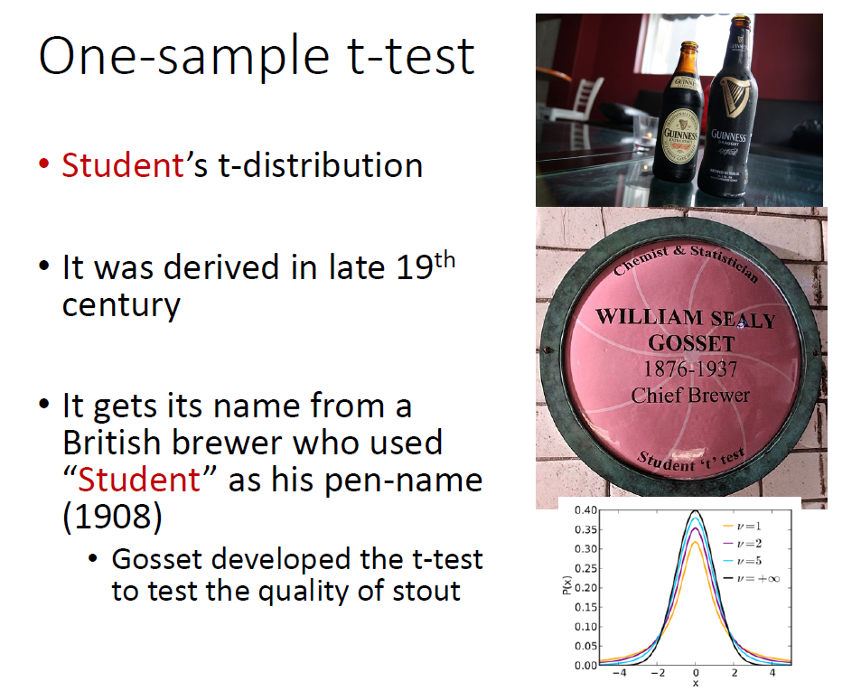

---
format:
  revealjs:
    title-slide: false   
    theme: [default]
#    smaller: true
    chalkboard: true
    scrollable: true
    self-contained: false
    highlight-style: pygments
    code-line-numbers: true
    code-overflow: wrap
    slideNumber: true
    transition: "fade"
    progress: true
    controls: false
    ratio: 3:2
    echo: true
    code-fold: true
    footer: |
      
---

<div style="display: flex; align-items: center; justify-content: space-between;">
<div style="flex: 0 0 40%;">
  
</div>
<div style="flex: 0 0 55%; text-align: left;">
  <h1 style="color: #153e6c; font-size: 2.8em; margin-bottom: 0.5em;">Hypothesis Testing I</h1>
  <p style="color: #153e6c; font-size: 1.8em;">Zhaoxia Yu</p>
</div>

</div>


## Load packages, read data
```{r}
#| code-fold: true
#| echo: true
library(tidyverse)
library(ggplot2)
```

## Outline 

- What does hypothesis testing do?

- We will use **testing a population proportion** as a running example to introduce the key concepts of hypothesis testing.


- Testing hypotheses about population mean.

## The Role of Hypothesis Testing

Statistical inference provides several tools:

- Estimate a population quantity.
- Quantify uncertainty.
- Test a scientific hypothesis.

**Hypothesis testing** helps determine whether the observed data provide sufficient evidence against a proposed explanation (the null hypothesis).


## Scientific Questions and Hypotheses

- Scientific research often begins with a **scientific question**.

Examples:

- Do more than half of people have a larger right hippocampus than their left hippocampus?

- Does more than 20% of patients respond to a new treatment?

- Is the average body temperature of healthy adults less than 98.6°F?


## Expressing Hypotheses Statistically

Scientific questions are translated into statements about **population parameters**.


A **hypothesis** is a testable statement about a population that can be evaluated using data.


- Do more than half of people have a larger right hippocampus than their left hippocampus? $p>0.50$

- Does more than 20% of patients respond to a new treatment? $p>0.20$

- Is the average body temperature of healthy adults less than 98.6°F? $\mu<98.6$


## Formulating a Hypothesis Test

<div style="font-size: 90%;">

Every hypothesis test consists of two competing hypotheses.

**Null Hypothesis** ($H_0$)

-   **Definition**: A statement is often about no effect or no difference, or nothing of interest.

-   **Purpose**: Serves as the default or starting assumption.

**Alternative Hypothesis** ($H_a$ or $H_1$)

-   **Definition**: A statement is often about an effect or a difference.

-   **Purpose**: Represents what we are trying to find evidence for.

</div>


## Formulating a Hypothesis Test: Example

<div style="font-size: 80%;">

- **Scientific Question:** Do more than half of people have a larger right hippocampus than their left hippocampus?

- **Parameter of Interest:** $p$: the proportion of people whose right hippocampus is larger than their left hippocampus.

- **Null Hypothesis:** $H_0: p = 0.5$
  - In testing a population proportion, the hypothetical value is often denoted as $p_0$. In this case, $p_0 = 0.5$.
  
- **Alternative Hypothesis:**   $H_a: p > 0.5$
  - Because we are interested in whether the proportion is greater than 0.5, we use a one-sided alternative hypothesis.
</div>


## Test Statistic

- A **test statistic** is a number calculated from the sample data.

- It summarizes the evidence **against the null hypothesis**.

- We compare the observed test statistic to its **null distribution**, the distribution expected if the null hypothesis is true.

- If the observed value is sufficiently unlikely under the null distribution, we reject $H_0$.


## Test Statistic: Example

- **Question:** Do more than half of people have a larger right hippocampus than their left hippocampus?

- Suppose we examine **100** people, and **62** have a larger right hippocampus.

- A natural test statistic is the **sample proportion**

  $$
  \hat p=\frac{62}{100}=0.62.
  $$

##

- Is **0.62** sufficiently larger than **0.50**, or could this difference be due to random sampling?

- To answer this question, we **standardize** the sample proportion.

- For testing a proportion, it is common to use the standardized test statistic: the **z-statistic**.


## Z-statistic

- Let $\hat p$ denote the sample proportion, $p_0$ denote the hypothesized population proportion under $H_0$, and $n$ denote the sample size. 

- The z-statistic is defined as
$$
z=\frac{\hat p-p_0}
{\sqrt{p_0(1-p_0)/n}},
$$

- If the null hypothesis is true, the z-statistic follows a standard normal distribution approximately when $n$ is large enough.


## Testing a Proportion: Example

- **Question:** Do more than half of people have a larger right hippocampus than their left hippocampus?

- Suppose we examine **100** people, and **62** have a larger right hippocampus.

- **Hypotheses:** $H_0: p = 0.50 \qquad\text{vs.}\qquad H_a: p > 0.50$

- **Sample proportion:** $\hat{p}=\frac{62}{100}=0.62.$

- **Test statistic:**
  $$z=\frac{0.62-0.50}{\sqrt{0.5(1-0.5)/100}}=2.40.$$


## The Null Distribution and Observed Z-statistic

- Is 2.40 extreme enough to reject the null hypothesis?

```{r}
#| fig.align='center'

library(ggplot2)

# Observed z-statistic
z <- 2.40

# Data for the standard normal curve
x <- seq(-4, 4, length.out = 1000)
df <- data.frame(
  x = x,
  y = dnorm(x)
)

# Right-tail region
tail_df <- subset(df, x >= z)

ggplot(df, aes(x, y)) +
  geom_line(linewidth = 1) +
  geom_vline(xintercept = z,
             linetype = "dashed",
             color = "red",
             linewidth = 0.8) +
  labs(
    x = "z",
    y = "",
    title = expression("Distribution Under " * H[0])
  ) +
  theme_classic(base_size = 18)
```


## The Null Distribution and Observed Z-statistic

```{r}
#| fig-align: center

pval <- pnorm(z, lower.tail = FALSE)

ggplot(df, aes(x, y)) +
  geom_line(linewidth = 1) +
  geom_area(
    data = tail_df,
    aes(x, y),
    alpha = 0.4,
    fill = "red"
  ) +
  geom_vline(
    xintercept = z,
    linetype = "dashed",
    color = "red",
    linewidth = 0.8
  ) +
  annotate(
    "text",
    x = z + 0.35,
    y = 0.06,
    label = "p-value",
    color = "red",
    hjust = 0
  ) +
#  annotate(
#    "text",
#    x = z + 0.45,
#    y = 0.03,
#    label = paste0("= ", round(pval, 4)),
#    color = "red",
#    hjust = 0
#  ) +
  labs(
    x = "z",
    y = "",
    title = expression("Distribution Under " * H[0])
  ) +
  theme_classic(base_size = 18)
```
  
## P-value

- The **p-value** measures how surprising the observed data are **if the null hypothesis is true**.

- **Definition:** The **p-value** is the probability, **assuming the null hypothesis is true**, of observing a test statistic **at least as extreme as the one observed**.

- A **small p-value** indicates strong evidence against the null hypothesis.

> **Important:** A p-value is **not** the probability that the null hypothesis is true. 


##

- **What does "extreme" mean?**
  - It means values that provide **at least as much evidence against the null hypothesis** as the observed test statistic.
  - For a **right-tailed** test ($H_a: p>p_0$), "more extreme" means **larger** values.
  - In our example, "as extreme as 2.40" means **2.40 or larger**.


## P-value: Example  

- Why are we interested in the area to the right of 2.40?
- Recall that $H_0: p = 0.50$ and $H_a: p > 0.50$. 

- In this example, the p-value is 
```{r}
pnorm(z, lower.tail = FALSE)
```

- It tell us the probability of observing a z-statistic as extreme or more extreme than 2.40 under the null hypothesis. 

- At level $\alpha=0.05$, we reject $H_0$ because  the p-value is less than 0.05.

## Significance Level ($\alpha$)

- The **significance level** ($\alpha$) is the threshold for deciding whether to reject the null hypothesis.

- It is chosen **before** analyzing the data.

- A common choice is
  \[
  \alpha = 0.05.
  \]

- **Decision rule:**
  - If the **p-value** $\le \alpha$, reject $H_0$.
  - If the **p-value** $> \alpha$, fail to reject $H_0$.

- Choosing $\alpha=0.05$ means we are willing to tolerate a **5% Type I error rate**.


## Two-Sided Test

What if $H_0: p = 0.50$ and $H_a: p \neq 0.50$?

```{r}
#| fig-align: center

left_df  <- subset(df, x <= -abs(z))
right_df <- subset(df, x >=  abs(z))

ggplot(df, aes(x, y)) +
  geom_line(linewidth = 1) +
  geom_area(
    data = left_df,
    aes(x, y),
    fill = "red",
    alpha = 0.4
  ) +
  geom_area(
    data = right_df,
    aes(x, y),
    fill = "red",
    alpha = 0.4
  ) +
  geom_vline(
    xintercept = c(-abs(z), abs(z)),
    linetype = "dashed",
    color = "red",
    linewidth = 0.8
  ) +
  annotate(
    "text",
    x = -abs(z) - 0.35,
    y = 0.06,
    label = "p-value/2",
    color = "red",
    hjust = 1
  ) +
  annotate(
    "text",
    x = abs(z) + 0.35,
    y = 0.06,
    label = "p-value/2",
    color = "red",
    hjust = 0
  ) +
  labs(
    x = "z",
    y = "",
    title = expression("Distribution Under " * H[0])
  ) +
  theme_classic(base_size = 18)
```
 

## Left-Sided Test

What if $H_0: p = 0.50$ and $H_a: p < 0.50$?

```{r}
#| fig-align: center

# Left-tail region
tail_df <- subset(df, x <= z)

ggplot(df, aes(x, y)) +
  geom_line(linewidth = 1) +
  geom_area(
    data = tail_df,
    aes(x, y),
    alpha = 0.4,
    fill = "red"
  ) +
  geom_vline(
    xintercept = z,
    linetype = "dashed",
    color = "red",
    linewidth = 0.8
  ) +
  annotate(
    "text",
    x = z - 0.35,
    y = 0.06,
    label = "p-value",
    color = "red",
    hjust = 1
  ) +
  labs(
    x = "z",
    y = "",
    title = expression("Distribution Under " * H[0])
  ) +
  theme_classic(base_size = 18)
```
 
 

# Test a Proprotion: Activities 

## Activities and Goals

- n = 20. 
- We will test

  $$
  H_0: p=0.50
  \qquad\text{vs.}\qquad
  H_a: p>0.50.
  $$

- Activity 1: Simulate data when the null hypothesis is true. Conduct the hypothesis test and discuss the results.

- Activity 2: Simulate data when the alternative hypothesis is true $p=0.7$. Conduct the hypothesis test and discuss the results.


## Activity 1: When $H_0$ Is True

- Change the random seed to any number.

- Run the code and compute the p-value.

- Based on the p-value, do you reject $H_0$ at the 5% significance level?


```{r}
#| eval: false

set.seed(2026)

p0 <- 0.50
p  <- p0      # H0 is true
n  <- 20

# Simulate data
x <- rbinom(1, n, p)

# Sample proportion
phat <- x / n

# z statistic
z <- (phat - p0) / sqrt(p0 * (1 - p0) / n)

# One-sided p-value: H1: p > p0
p.value <- pnorm(z, lower.tail = FALSE)

cat("Number of successes:", x, "\n")
cat("Sample proportion:", round(phat, 3), "\n")
cat("z statistic:", round(z, 3), "\n")
cat("p-value:", round(p.value, 4), "\n")
```


## Activity 1: Discussion

Since $H_0$ is actually true,

- If you **fail to reject** $H_0$, the decision is **correct**.

- If you **reject** $H_0$, you have made a **false positive (Type I error)**.

Will everyone obtain the same answer? Why or why not?


## Activity 2: When $H_a$ Is True

Now change $p$ to 0.7 and repeat the activity.
```{r}
p <- 0.70
```

- Do you reject $H_0$ at the 5% significance level?
  - If you reject $H_0$, the decision is **correct**.

- Do you fail to reject $H_0$ at the 5% significance level?
  - If you fail to reject $H_0$, you have made a **false negative (Type II error)**.


## Summary

  - Suppose the null is true. What can happen? 
    - Fail to reject $H_0$ - True Negative (TN)
    - Reject $H_0$: False Positive (FP): Type I error
    - The rate of type I error is called type I error rate. 
  - Suppose the alternative is true
    - Reject $H_0$: True Positive (TP) 
    - Fail to reject $H_0$: False Negative (FN): Type II error
    - The rate of true positive is called the statistical power of a test. 

## Summary

| **Truth** | **Fail to Reject $H_0$** | **Reject $H_0$** |
|------------|----------------------------|--------------------|
| **$H_0$ is true** | **True Negative (TN)** | **False Positive (FP)** *(Type I error)* |
| **$H_a$ is true** | **False Negative (FN)** *(Type II error)* | **True Positive (TP)** |

- **Type I error rate**: Probability of a **false positive**.
- **Power**: Probability of a **true positive** ($1-$ Type II error rate).

## Discussion
- p-value is only one piece of information in hypothesis testing.

- Report treatment effect, standard error, CI. 

- Statistical Significance
  - A small p-value might be due to a large sample size but a small effect
  
- Scientifically Significance
  - How large is the effect? Is it meaningful in practice?

#


# Mean

## Hypothesis testing for the population mean
- Consider hippocampal volume in impaired males, where we want to examine the null hypothesis 

$H_{0}: \mu = 6$ against the alternative hypothesis $H_A: \mu >6$.

- The alternative hypothesis $H_{A}: \mu >6$ is a **one-sided** alternative.
- One-sided vs two-sided alternatives:
  - One-sided: $H_A: \mu > \mu_0$ or $H_A: \mu < \mu_0$
  - Two-sided: $H_A: \mu \neq \mu_0$


## Hypothesis testing for the population mean
- We learned the sample mean is a reasonable estimator of the population mean.
- The sample mean of hippocampal volume of impaired males is $\bar x=6.1$. 
- What does the sample mean tell you? Should you reject $H_0$ based on the sample mean?
- Of course not, because a sample mean alone doesn't tell us **how unusual** it is under $H_0$.

## Why Isn't $\bar{x} = 6.1$ Enough?

- Suppose we want to test: $H_0: \mu = 6.00$ vs. $H_1: \mu > 6.00$
- The observed sample mean $\bar{x} = 6.1$ is higher. But how much higher is "a lot"?
- A difference of 0.1 could be:
  - A large difference if there's little variation
  - A small difference if there's a lot of variation
- We need to **quantify uncertainty** around $\bar{x}$ by considering how $\bar{X}$ behaves under the null hypothesis $H_0$.

## p-value

- We quantify "how extreme" using the probability of values as or more extreme than the observed value, based on the ***null*** distribution ***in the direction*** supporting the alternative hypothesis. 

- This probability is also called the **p-value** and denoted $p$.

- For the above example, 
$$\begin{equation*}
p = P(\bar{X}  \ge \bar{x} | H_{0}),
\end{equation*}$$

where $\bar{x}=6.1$ in this example.


## The Null Distribution of $\bar{X}$ (Known σ)

- Suppose $\sigma = 1$ and sample size is $n = 25$
- Then, under the null hypothesis $H_0: \mu = 6.00$:

$$
\bar{X} \sim N\left(\mu = 6.00,\ \frac{\sigma}{\sqrt{n}} = \frac{1}{5}=0.2 \right)
$$

- $P(\bar X \ge 6.1 | H_0)$ is the area under the curve to the right of $\bar{x} = 6.1$ in the null distribution.

## $P(\bar X \ge 6.1 | H_0)$ 

```{r, fig.align='center'}
#| code-fold: true
#| echo: true

library(ggplot2)

# Define parameters
mu0 <- 6.00
se <- 0.2
x_obs <- 6.10

# Create a sequence of x values centered around mu0
x_vals <- seq(mu0 - 4 * se, mu0 + 4 * se, length.out = 1000)

# Compute the density
density_vals <- dnorm(x_vals, mean = mu0, sd = se)

# Create a data frame
df <- data.frame(x = x_vals, y = density_vals)

# Define the tail area (right of observed x)
df$tail <- ifelse(df$x >= x_obs, "Right Tail", "Main")

# Plot
ggplot(df, aes(x, y)) +
  geom_line(color = "darkblue", size = 1) +
  geom_area(data = subset(df, tail == "Right Tail"), aes(x, y),
            fill = "red", alpha = 0.4) +
  geom_vline(xintercept = x_obs, color = "red", linetype = "dashed") +
  annotate("text", x = x_obs + 0.1, y = 0-0.1,
           label = "sample mean = 6.1", color = "red", hjust = 0) +
  annotate("text", x = x_obs + 0.1, y = max(df$y) * 0.9,
           label = "p=0.31", color = "red", hjust = 0) +
  labs(title = "Sampling Distribution of Sample Mean (under H_0)",
       subtitle = expression(paste("N(", mu[0], " = 6.00, SE = 0.2)")),
       x = expression(bar(X)), y = "Density") +
  theme_minimal(base_size = 14)

```

## Z-score
- It is easier to use the **z-score** 
$$Z=\frac{\bar X - \mu_0}{\sigma/\sqrt{n}}, z=\frac{\bar x - \mu_0}{\sigma/\sqrt{n}}$$


- This is because because 
  - $P(\bar X \ge 6.1 | H_0) =P(Z\ge 0.5)\approx 0.31$
where $Z\sim N(0,1)$. 


## $P(Z \ge z)$ 

```{r, fig.align='center'}
#| code-fold: true
#| echo: true

library(ggplot2)

# Define parameters
mu0 <- 0
se <- 1
x_obs <- 0.5

# Create a sequence of x values centered around mu0
x_vals <- seq(mu0 - 4 * se, mu0 + 4 * se, length.out = 1000)

# Compute the density
density_vals <- dnorm(x_vals, mean = mu0, sd = se)

# Create a data frame
df <- data.frame(x = x_vals, y = density_vals)

# Define the tail area (right of observed x)
df$tail <- ifelse(df$x >= x_obs, "Right Tail", "Main")

# Plot
ggplot(df, aes(x, y)) +
  geom_line(color = "darkblue", size = 1) +
  geom_area(data = subset(df, tail == "Right Tail"), aes(x, y),
            fill = "red", alpha = 0.4) +
  geom_vline(xintercept = x_obs, color = "red", linetype = "dashed") +
  annotate("text", x = x_obs + 0.1, y = 0-0.1,
           label = "z = 0.5", color = "red", hjust = 0) +
  annotate("text", x = x_obs + 0.1, y = max(df$y) * 0.9,
           label = "p=0.31", color = "red", hjust = 0) +
  labs(title = "Sampling Distribution of Sample Mean (under H_0)",
       subtitle = expression(paste("N(", mu[0], " = 0, SE = 1)")),
       x = expression(bar(Z)), y = "Density") +
  theme_minimal(base_size = 14)

```

## What If σ Is Unknown?

- In real life, we rarely know the population standard deviation $\sigma$
- Instead, we estimate it with the sample standard deviation $s$
- This changes the **distribution** of our test statistic:
  - We no longer use the standard normal ($z$)
  - We use the **$t$ distribution**

## The $t$ Distribution

- If $\sigma$ is unknown, and we use $s$ to estimate $\sigma$, then:

$$
T = \frac{\bar{X} - \mu}{S / \sqrt{n}} \sim t_{n - 1}
$$

- The $t$ distribution accounts for extra uncertainty from estimating $\sigma$
- It's wider than the normal, especially with small $n$
- As $n \to \infty$, $t$ approaches the standard normal.

## Why This Matters

- Whether you use $z$ or $t$ affects:
  - Which critical value you compare to
  - How you compute the $p$-value
- This distinction becomes **crucial** when sample size is small


## One-sample t-test

- So far, we have assumed that the population variance
$\sigma^{2}$ is known. 

- In reality,
$\sigma^{2}$ is almost always unknown, and we need to estimate it from
the data. 

- As before, we estimate $\sigma^{2}$ using the sample variance
$S^{2}$. 

- Similar to our approach
for finding confidence intervals, we account for this additional source
of uncertainty by using the $t$-distribution with $n-1$ degrees of
freedom instead of the standard normal distribution. 

- The hypothesis
testing procedure is then called the **t-test**.

## t-test
::: {style="text-align: center;"}
{width="75%"}
:::

## Hippocampus volume in impaired males

```{r, fig.align='center'}
#| code-fold: true
#| echo: true

#read data
alzheimer_subset <- read_csv("../data/alzheimer_data.csv") %>% select(diagnosis, lhippo, rhippo, age, female) %>% mutate(hippo=lhippo+rhippo) %>% filter(diagnosis==1, female==0)
glimpse(alzheimer_subset)

#calculate mean
mean(alzheimer_subset$hippo)

#compute t-test using mean and sd
z=mean(alzheimer_subset$hippo-6)/sd(alzheimer_subset$hippo)*sqrt(nrow(alzheimer_subset))

#compute one-sided p
pnorm(z, lower.tail = FALSE)

#use t.test (one-sample t-test)
t.test(alzheimer_subset$hippo, mu=6, alternative="greater")
```

## One-sample t-test


- Using the observed values of $\bar{X}$ and $S$, the observed value of
the test statistic is obtained as follows: $t  =  \frac{\bar{x} - \mu_{0}}{s/\sqrt{n}}$.

- We refer to $t$ as the $t$-*score*. Then,
$$\begin{array}{l@{\quad}l}
\mbox{if}\ H_{A}: \mu < \mu _0, &  p_{\mathrm{obs}} = P(T \leq t), \\
\mbox{if}\ H_{A}: \mu > \mu _0, & p_{\mathrm{obs}} = P(T \geq t ), \\
\mbox{if}\ H_{A}: \mu \ne \mu _0, & p_{\mathrm{obs}} = 2 \times P\bigl(T \geq | t | \bigr),
\end{array}$$

- Here, $T$ has a $t$-distribution with $n-1$ degrees of freedom, and $t$
is our observed $t$-score. 

