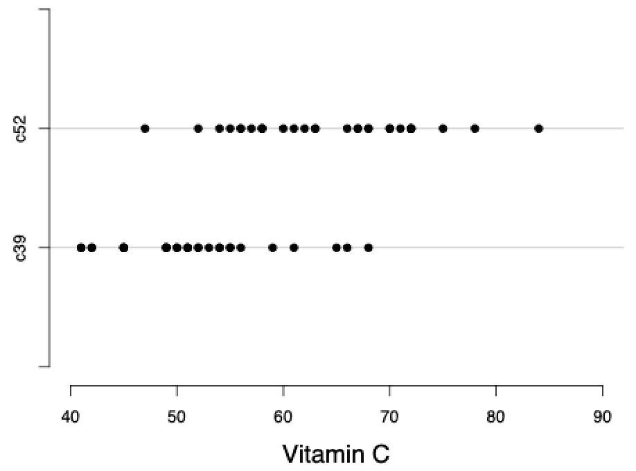
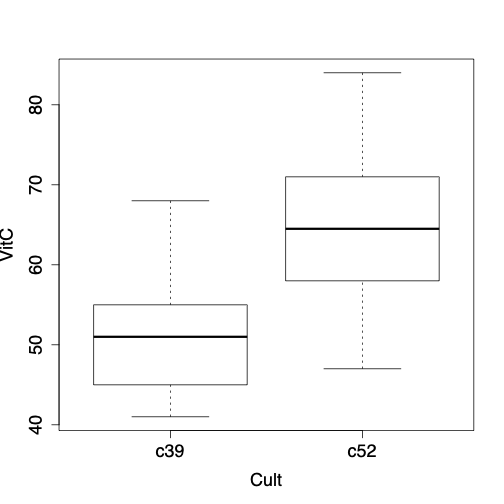
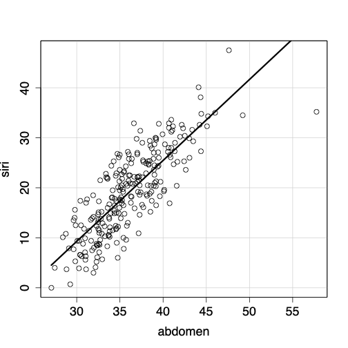
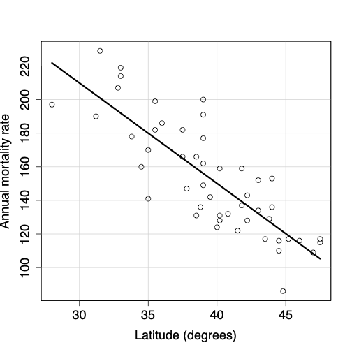
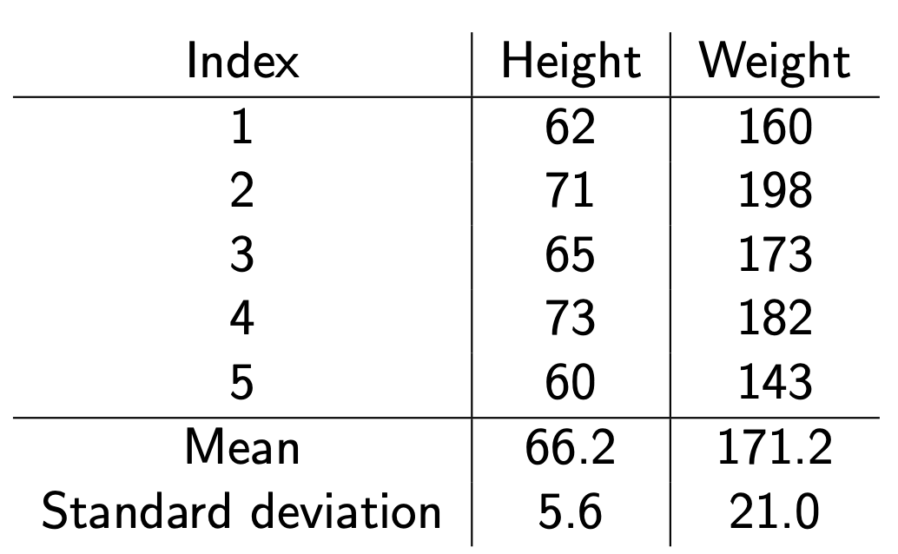
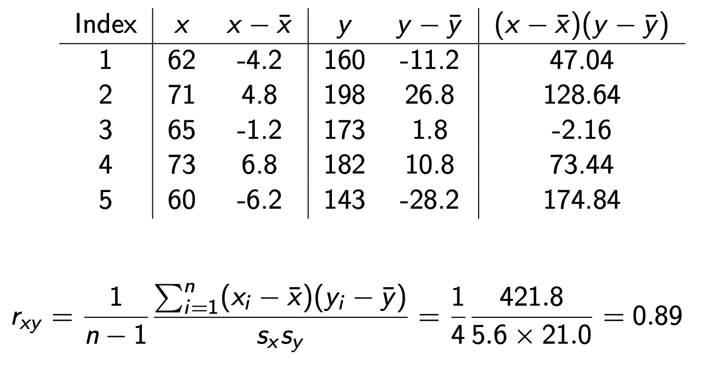
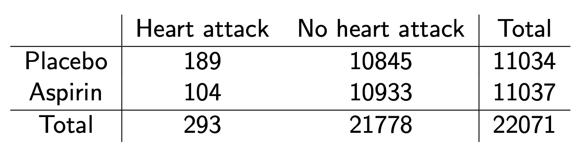

```{r}
#| include: false
knitr::opts_chunk$set(
  echo = TRUE,
  eval = TRUE,
  message = FALSE,
  warning = FALSE,
  fig.align = "center",
  fig.height = 9
)
ggplot2::theme_set(ggplot2::theme_light(base_size = 20))
```

```{r echo = FALSE, message = FALSE}
library(fabricerin)
library(openintro)
library(tidyverse)
library(DiagrammeR)
library(DiagrammeRsvg)
library(rsvg)
library(magrittr)
library(MASS)
```

## Objective

- We want to explore and examine possible relationships between two variables. 

. . . 

- We first focus on the case where we are investigating a relationship between one binary categorical variable (e.g., gender) and one numerical variable (e.g., body temperature).  

. . . 

- Then, we examine the relationship between two numerical variables (e.g., years of education and income). 

. . . 

- Finally, we discuss the relationship between two categorical variables (e.g., treatment and survival status).


## Relationship Between a Numerical Variable and a Binary Variable

- In these situations, the binary variable typically represents two different groups or two different experimental conditions. 

. . . 

- We treat the binary variable (factor) as the explanatory variable in our analysis. 

. . .

- Thus, the numerical variable is regarded as the response (target) variable (e.g., body temperature).


## Relationship Between a Numerical Variable and a Binary Variable

```{r, echo=FALSE,out.width='45%',out.height='30%',fig.align='center', eval = T}

```
Dot plots of vitamin C content (numerical) by cultivar (categorical) for the `cabbages` data set from the `MASS` package.


## Relationship Between a Numerical Variable and a Binary Variable

A more common way of visualizing the relationship between a numerical
variable and a categorical variable is to create boxplots like we did yesterday.


```{r, echo=FALSE,out.width='35%',out.height='20%',fig.align='center', eval = T}

```


## Relationship Between a Numerical Variable and a Binary Variable

- In general, we say that two variables are related if the distribution
of one of them changes as the other one varies.

. . . 

- We can measure changes in the distribution of the numerical variable by obtaining its summary statistics for different levels of the categorical variable.

. . . 

- it is common to use the __difference of means__ when examining the relationship between a numerical variable and a categorical variable. 

. . . 

- In the above example, the difference of means of vitamin C content is $64.4 - 51.5 = 12.9$ between the two cultivars. Is this difference __significant__? (this is what we test)


## Two sample t-test

- In general, we can denote the population means of two groups as $\mu_{1}$ and
$\mu_{2}$. 

. . . 

- The null hypothesis indicates that the population means are equal,
$H_{0}: \mu_{1} = \mu_{2}$. 

. . . 

- In contrast, the alternative hypothesis is one the following:
$$\begin{array}[t]{l@{\quad}p{6.7cm}}
H_{A}: \mu_{1} > \mu_{2} \\
H_{A}: \mu_{1} < \mu_{2}   \\
H_{A}: \mu_{1} \ne \mu_{2}  \\
\end{array}$$


## Two sample t-test

- We can also express these hypotheses in terms of the
*difference* in the means: 

. . . 

$$\begin{array}[t]{l@{\quad}p{6.7cm}}
H_{A}: \mu_{1}  - \mu_{2} > 0 \\
H_{A}: \mu_{1} - \mu_{2} < 0  \\
H_{A}: \mu_{1} - \mu_{2} \ne 0  \\
\end{array}$$

. . . 

- Then the corresponding null hypothesis is that there is no difference
in the population means, $$H_{0}: \mu_{1} - \mu_{2} = 0$$


## Two sample t-test


- Previously, we used the sample mean $\bar{X}$ to perform statistical
inference regarding the population mean $\mu$. 

. . .

- To evaluate our hypothesis regarding the difference between two means, $\mu_{1} - \mu_{2}$, it is reasonable to examine the difference between the sample means, $\bar{X}_{1} - \bar{X}_{2}$, as our test statistic. 

. . . 

- For this, we can simply use the `t.test()` function in R.


## Two sample t-test

Cabbages example:

```{r}
library(MASS)
data(cabbages)

t.test(VitC ~ Cult, data=cabbages)
```


## Paired t-test

- While we hope that the two samples taken from the population are
comparable except for the characteristic that defines the grouping,
this is not guaranteed in general. 

. . . 

- To mitigate the influence of other important factors (e.g., age) that are not the focus
of our study, we sometimes **pair** (match) each individual in one group with an
individual in the other group so that the paired individuals are very
similar to each other except for the variable that defines the
grouping. 

. . . 

- For example, we might recruit twins and assign one of them to the treatment group and the other one to the placebo group.

. . . 

- Sometimes, the subjects in the two groups are the same individuals under two different conditions. 


## Paired t-test

- When the individuals in the two groups are paired, we use the **paired**
$t$-test to take the pairing of the observations between the two
groups into account.

. . . 

- Using the difference, $D$, between the paired observations, the
hypothesis testing problem reduces to a single sample $t$-test problem.

. . . 

- In practice, we can use the function `t.test()` with the option `paired=TRUE`.


## Paired t-test

- As an example, we use the study of the effect of tobacco smoke on platelet function by Levine (1973). 

. . . 

- In his study, for a group of eleven people, platelet aggregation was measured before and after smoking a cigarette. 

. . . 

- Therefore, observations in the `Before` sample and `After` sample are from the same subjects. 

. . . 

- For each subject, an observation in the `Before` sample is paired with an observation in the `After` sample. 


## Paired t-test

Platelet example:

```{r}
Platelet<- read.table("../data/Platelet.txt", header=T, sep="")
glimpse(Platelet)
```


## Paired t-test

Let's run a paired t-test

```{r}
t.test(Platelet$Before, Platelet$After, paired = TRUE)
```


## Paired t-test

See what happens if we fail to account for the pairing of observations!
```{r}
t.test(Platelet$Before, Platelet$After)
```


## Two numerical variables

- A simple way to visualize the relationship between two numerical
variables is with a __scatterplot__. 

. . . 

- As our first example, we use the `bodyFat` data: http://lib.stat.cmu.edu/datasets/bodyfat. 

. . . 

- Suppose that we are interested in examining the relationship between
percent body fat (`siri`) and abdomen circumference (`abdomen`) among men.


## Scatterplot

The plot suggests that the increase in percent body fat tends to coincide with the increase in abdomen circumference.
```{r, echo=FALSE,out.width='40%',out.height='20%',fig.align='center', eval = T}

```


## Scatterplot

Next, we examine the relationship between the annual
mortality rate due to malignant melanoma for US states and the latitude
of their centers. 
```{r, echo=FALSE,out.width='40%',out.height='20%',fig.align='center', eval = T}

```


## Scatterplot

```{r, echo=FALSE,out.width='40%',out.height='20%',fig.align='center', eval = T}

```

- Using scatterplots, we could detect possible relationships between two
numerical variables. 


## Scatterplot

```{r, echo=FALSE,out.width='40%',out.height='20%',fig.align='center', eval = T}

```

- In both examples, we can see that changes in one variable
coincides with substantial __systematic__ changes (increase or
decrease) in the other variable. 


## Scatterplot

```{r, echo=FALSE,out.width='40%',out.height='20%',fig.align='center', eval = T}

```

- Since the overall relationship can be presented by a straight line, we say
that the two variables have __linear relationship__. 


## Scatterplot

```{r, echo=FALSE,out.width='40%',out.height='20%',fig.align='center', eval = T}

```

- We say that percent body fat and abdomen circumference have __positive linear relationship__. 


## Scatterplot

```{r, echo=FALSE,out.width='40%',out.height='20%',fig.align='center', eval = T}

```

- In contrast, we say that annual mortality rate due to malignant melanoma and latitude have __negative linear relationship__. 


## Correlation

- To quantify the strength and direction of _linear_ relationship between two numerical variables, we can use __Pearson's correlation coefficient__, $r$, as a summary statistic. 

. . .

- The value of $r$ is always between $-1$ and $+1$ and the relationship is strong when $r$ approaches $-1$ or $+1$.

. . . 

- The sign of $r$ shows the direction (negative or positive) of the linear relationship. 

. . . 

- For observed pairs of values, $(x_{1}, y_{1}), (x_{1},y_{1}), \ldots, (x_{n}, y_{n})$, 

$$\begin{eqnarray*}
r_{xy} = \frac{\sum_{i=1}^{n}(x_{i}-\bar{x})(y_{i}- \bar{y})}{(n-1)s_{x}s_{y}}
\end{eqnarray*}$$


## Correlation

Let's look at the correlation between height and weight.

```{r, echo=FALSE,out.width='60%',out.height='20%',fig.align='center', eval = T}

```


## Correlation

We can do some fancy math to calculate $r$.

```{r, echo=FALSE,out.width='70%',out.height='20%',fig.align='center', eval = T}

```


## Correlation

- We can examine whether the correlation is statistically significant or not using the `cor.test()` function in R.


## Correlation

- The following code tests whether the correlation coefficient between `siri` and `abdomon` is greater than zero. 


```{r}
data(bodyfat, package="mfp")
bodyfat$abdomen = bodyfat$abdomen *.39
cor.test(bodyfat$siri, bodyfat$abdomen, alternative = "greater")
```


## Correlation

Later, we will discuss more advanced models for examining such relationships using linear regression models.


## Two categorical variables

- We now discuss techniques for exploring
relationships between categorical variables. 

. . . 

- As an example, we consider the five-year study to investigate whether regular aspirin intake reduces
the risk of cardiovascular disease. 

. . . 

- We usually use __contingency tables__ to summarize such data.

```{r, echo=FALSE,out.width='70%',out.height='20%',fig.align='center', eval = T}

```


## Two categorical variables

- Each cell shows the frequency of one possible combination of disease status (heart attack or no heart attack) and experiment group (placebo or aspirin). 

. . . 

- Using these frequencies, we can
calculate the __sample proportion__ of people who suffered from heart attack in each experiment group separately. 

. . . 

- There were 11034 people in the placebo group, of which 189 had heart attack. The
proportion of people suffered from a heart attack in the placebo group
is therefore $p_1 = {189}/{11034} = 0.0171$. 

. . . 

- The proportion of people suffered from heart attack in the aspirin
group is $p_2 = {104}/{11037} = 0.0094$.


## Two categorical variables

- Here, we refer to these proportions as the __risk__ of heart attack for the two groups.

. . . 

- Substantial difference between the sample proportion of heart attack between the two experiment groups could lead us to believe that the treatment and disease status are related.

. . . 

- A common summary statistic for comparing sample proportions is
the __relative proportion__: $p_{2}/p_{1}$. 


## Two categorical variables

- Since the sample proportions in this case are related to the risk of  heart attack, we
refer to the relative proportion as the __relative risk__. 

. . . 

- Here, the relative risk of suffering from heart attack is $${p_2}/{p_1} = {0.0094} / {0.0171}= 0.55$$

. . . 

- This means that the risk of a heart attack in the aspirin group is 0.55 times of the risk in the placebo group.


## Two categorical variables

- It is more common to compare the __sample odds__,
$$\begin{equation*}
o=\frac{p}{1-p},
\end{equation*}$$

. . .

- This is slightly different from the proportions we are used to

. . .

- The odds of a heart attack in the placebo group, $o_1$, and in the aspirin group, $o_2$, are
$$\begin{eqnarray*}
o _1 &=& \frac{0.0171}{(1-0.0171)} = 0.0174, \\
o _2 &=& \frac{0.0094}{(1-0.0094)} = 0.0095.
\end{eqnarray*}$$


## Two categorical variables

- We usually compare the sample odds using the __sample odds ratio__

$$\begin{eqnarray*}
\mathit{OR}_{21} = \frac{o_2}{o _1} = \frac{0.0095}{0.0174}= 0.54.
\end{eqnarray*}$$

. . . 

- Later, we will discuss more advanced models for making statistical inference about odds ratio using logistic regression models.

. . . 

- Here, we use a simpler approach for assessing the significance of the relationship between two binary (and in general, two categorical) variables presented as a contingency table.  


## Pearson's $\chi^{2}$ Test of Independence

- As discussed above, we can use contingency tables to find the observed frequencies for different combinations of categories of the two variables. 

. . . 

- We denote the **observed** frequency in row $i$ and column $j$ as $O_{ij}$.

. . . 

- Using the independence rule, we can find the **expected** frequencies under the null hypothesis, which indicates that the two variables are independent. 

. . . 

- Recall that for two independent random variables, the joint
probability is equal to the product of their individual probabilities.


## Pearson's $\chi^{2}$ Test of Independence

- Pearson's $\chi^{2}$ test uses a test statistic, which we
denote as $Q$, to measure the discrepancy between the observed data and
what we expect to observe under the null hypothesis (i.e., assuming the null hypothesis is true).

. . . 

- Note that the null hypothesis in this case states that the two variables are independent. 


## Pearson's $\chi^{2}$ Test of Independence

- We denote the expected frequency in row $i$ and column $j$ as $E_{ij}$.

. . . 

- Pearson's $\chi^{2}$ test summarizes the differences between the expected
frequencies (under the null hypothesis) and the observed frequencies
over all cells of the contingency table,

$$\begin{equation*}
Q =  \sum_{i} \sum_{j} \frac{(O_{ij} - E_{ij})^{2}}{E_{ij}}.
\end{equation*}$$


## Pearson's $\chi^{2}$ Test of Independence

- In practice, you don't need to worry about the fancy equations

. . . 

- We can use the `chisq.test()` in R.

```{r, echo=FALSE,out.width='70%',out.height='20%',fig.align='center', eval = T}

```

```{r}
asp <- matrix(c(189, 10845, 104, 10933), nrow=2, ncol=2, byrow = TRUE)
asp
chisq.test(asp)
```


## Smoking and low birthweight babies

As another example, we will examine the association between smoking during pregnancy and having low birth weight babies using the `birthwt` from the `MASS` package. 


## Smoking and low birthweight babies

Let's code a little bit

```{r, message=FALSE}
library(MASS)
data("birthwt") 
birthwt <- birthwt %>% 
  as_tibble() %>% 
  mutate(across(c(low, race, smoke, ht), as.factor))
head(birthwt)
```


## Smoking and low birthweight babies

Running `chisq.test()`

```{r}
tab <- table(birthwt$smoke, birthwt$low)
res <- chisq.test(tab)
tab
res
```


## Smoking and low birthweight babies

We can check the expected counts under the null hypothesis, and also see the observed accounts from the data.

```{r}
res$observed
res$expected
```


## Schedule for more coding examples

- Confidence interval for the population mean
- One-sample t-test
- Test for Proportion
- Two-sample t-test
- Correlation test
- $\chi^2$ test


## Simulated Data

Let's try this on some simulated data like we have before.

```{r}
set.seed(0) # We set a seed which makes the randomization work the same
norm_size <- 100
norm_random <- rnorm(n = norm_size, mean = 10, sd = 2) # simulate 100 draws from a N(10, 2) distribution
summary(norm_random) # let's see some summary statistics about our generated data
```


## Quick Confidence Interval Review

Now, get a quick confidence interval 

```{r}
# t-test that the mean of the data = 0
# we can add mu = 10 to change the mean we want to test for
t_test_result <- t.test(x = norm_random) 

# in this case we don't really care about the hypothesis 
# we just want a confidence interval for the mean
t_test_result$conf.int 
```


## Adjust the confidence level

We can lower our confidence level, which leads to a narrower interval:
```{r}
# we adjust the confidence level with the conf.level argument
# if we lower the confidence level it leads to a narrower interval
t_test_result <- t.test(x = norm_random, conf.level = 0.9) 
t_test_result$conf.int
```


## Adjust the confidence level

To have a higher confidence level, we need a broader interval:
```{r}
# if we increase the confidence level we widen the interval
t_test_result <- 
  t.test(x = norm_random, conf.level = 0.99)
t_test_result$conf.int
```


## Hypothesis Testing

We mentioned hypothesis testing earlier, now let's try and perform a hypothesis test in R.

```{r}
summary(norm_random)
```

$H_0:\mu=10$ vs. $H_A:\mu\neq10$
```{r}
t.test(x = norm_random, mu = 10)$p.value
```


## Hypothesis Testing (One-sided)

$H_0:\mu=10$ vs. $H_A:\mu>10$
```{r}
t.test(x = norm_random, mu = 10, 
       alternative = "greater")$p.value
```

. . .

$H_0:\mu=9$ vs. $H_A:\mu>9$

```{r}
t.test(x = norm_random, mu = 9, 
       alternative = "greater")$p.value
```


## Back to the Alzheimer Data

Let's load the packages and data

```{r, message=F, warning=F, eval = T}
library(tidyverse)
alzheimer_data <- read.csv("../../data/alzheimer_data.csv") 
# you probably have this and can name it whatever you like! 
```


## Practice 1: Confidence Interval

Try to get a 90 percent confidence interval for the population mean of age among AD subjects.

```{r}
summary(alzheimer_data$age)
```


## Practice 1: Confidence Interval

Try to get a 90 percent confidence interval for the population mean of age among AD subjects.

```{r}
t_test_age <- t.test(alzheimer_data$age, conf.level = 0.9)
t_test_age$conf.int
```


## Practice 2: One Sample t-test

Test whether the population mean of age is 70 or greater than 70 and get the p-value.

$H_0:\mu=70$ vs. $H_A:\mu>70$

```{r}
summary(alzheimer_data$age)
```


## Practice 2: One Sample t-test

Test whether the population mean of age is 70 or greater than 70 and get the p-value.

$H_0:\mu=70$ vs. $H_A:\mu>70$

```{r}
t_test_age <- t.test(alzheimer_data$age, mu = 70, alternative = "greater")
round(t_test_age$p.value, 4)
```


## Confidence Interval for Population Proportion

Let's simulate some more data. This time, we flip a rigged coin 100 times.

```{r}
set.seed(0)
bern_size <- 100
bern_random <- rbinom(bern_size, 1, 0.3)
head(bern_random, 10)
success_counts <- sum(bern_random)
success_counts
```


## Confidence Interval for Population Proportion

Now, let's confidence interval for the chance of landing a heads.

```{r}
prop_test_result <-
  prop.test(x = success_counts, 
            n = bern_size)
prop_test_result$conf.int
```


## Hypothesis Testing for Population Proportion

And we can formulate a hypothesis test for this proportion.

$H_0:p=0.3$ vs. $H_A:p\neq0.3$

```{r}
prop_test_result <-
  prop.test(x = success_counts, 
            n = bern_size, 
            p = 0.3)
prop_test_result$p.value
```


## Real Data Practice (brain volume: naccicv)

Now, lets try this on the alzheimer data

```{r}
success_counts_naccicv <- 
  alzheimer_data %>%
  filter(naccicv > 1300 & naccicv < 1600) %>%  # we want brain volume between 1300 and 1600ml, as a indicator of a healthy human brain size
  nrow()
bern_size_naccicv <- nrow(alzheimer_data)
success_counts_naccicv
bern_size_naccicv
```


# Practice 

- Test whether the population proportion of people with normal brain volume is 2/3.

- Get a 95 percent confidence interval for the population proportion.

. . . 

```{r}
prop_test_result_naccicv <-
  prop.test(x = success_counts_naccicv, 
            n = bern_size_naccicv, 
            p = 2/3, 
            conf.level = 0.95)
prop_test_result_naccicv$conf.int
prop_test_result_naccicv$p.value
```


## Comparing Two Samples

Is blood pressure associated with gender?

```{r, echo = F, fig.height = 6, fig.width = 6, fig.align = "center", eval = T}
library(ggplot2)
ggplot(data = alzheimer_data, 
       aes(x = factor(female), y = bpsys)) + 
  geom_boxplot() + 
  labs(x = "female")
```


## Two Sample t-test

We can examine whether the average blood pressure is different between male and female? Note that the boxplots above show the medians not the means.

$H_0:\mu_M=\mu_F$ vs. $H_A:\mu_M \neq \mu_F$ 

```{r}
t.test(bpsys ~ female, data = alzheimer_data)$p.value
```


## Two Numerical Variables

Question: Are age and blood pressure correlated?

```{r, echo = F, fig.height = 6, fig.width = 6, fig.align = "center", eval = T}
ggplot(data = alzheimer_data, 
       aes(x = age, y = bpsys)) + 
  geom_point()
```


## Correlation Test

$H_0:$ They are NOT correlated. vs. $H_A:$ They are correlated.

```{r}
# here, we are testing for a r = 0
cor.test(alzheimer_data$age, alzheimer_data$bpsys)$p.value
```

$H_0:$ They are NOT correlated. vs. $H_A:$ They are positively correlated.

```{r}
# here, we do the same but we only test for a positive association using a one-sided test
cor.test(alzheimer_data$age, alzheimer_data$bpsys, alternative = "greater")$p.value
```


## Two Categorical Variables

Question: Are gender and disease status associated with each other?

```{r, eval = T}
contingency_table <- table(alzheimer_data$female, alzheimer_data$diagnosis)
contingency_table
```


## Pearson's $\chi^2$ Test of Independence

$H_0:$ They are independent vs. $H_A:$ They are NOT independent.

```{r}
# this is similar to cor.test, but for categorical variables instead of numeric ones
chisq.test(contingency_table)
```


## Summary

- "t.test()" for one/two-sample t-test
- "prop.test()" for proportion
- "cor.test()" for correlation test
- "chisq.test()" for $\chi^2$ test
- Useful arguments: "mu", "conf.level", "alternative"
- ?t.test, ?prop.test, ?cor.test and ?chisq.test for more information


# More hypothesis testing

Let's do a little data transformation first

```{r, eval = T}
alzheimer_data <- read.csv('../data/alzheimer_data.csv') %>% 
  dplyr::select(id, diagnosis, age, educ, female, height, weight, lhippo, rhippo) %>% 
  mutate(diagnosis = as.factor(diagnosis), 
         female = as.factor(female),
         hippo=lhippo + rhippo)


alzheimer_healthy <- read.csv('../data/alzheimer_data.csv') %>% 
  dplyr::select(id, diagnosis, age, educ, female, height, weight, lhippo, rhippo) %>% 
  mutate(diagnosis = as.factor(diagnosis),
         female = as.factor(female), 
         hippo=lhippo+rhippo) %>% 
  filter(diagnosis==0)
```


## EXAMPLE: Two-Sample t-test

Ex. Do healthy men and women have the same mean left hippocampal volume?

-   Categorical (gender) and Numerical (Left Hippocampus) :

    -   Side by Side Boxplot

    -   Side by Side Violin

    -   2 Histograms

## Example: Visualization -- boxplot

```{r, fig.align='center', eval = T}
#| code-fold: true
#| echo: true

ggplot(data= alzheimer_healthy,
       mapping= aes(x= female, 
                    y=lhippo,
                    fill=female)) +
  geom_boxplot()+
  labs(
    title="Boxplot of lhippo by Gender",
    x="Gender",
    y="LHippo volume (cm^3)") +  
  theme_minimal()
```

## Example: Visualization -- violin

```{r, fig.align='center', eval = T}
#| code-fold: true
#| echo: true
ggplot(data= alzheimer_healthy,
       mapping= aes(x= female, 
                    y=lhippo,
                    fill=female)) +
  geom_violin()+
  labs(
    title="Violin of lhippo by Gender",
    x="Gender",
    y="LHippo volume (cm^3)") +  
  theme_minimal()
```

## Example: Visualization -- histogram

```{r, fig.align='center', eval = T}
#| code-fold: true
#| echo: true
ggplot(data= alzheimer_healthy,
       mapping= aes(x=lhippo,
                    fill=female)) +
  geom_histogram(bins=35)+
  labs(
    title="Histogram of Lhippo by Gender",
    x="LHippo volume (cm^3)",
    y="Count") 
```

## Example: use two-sample t-test

```{r, fig.align='center'}
#| code-fold: true
#| echo: true
#| eval: true

t.test(alzheimer_healthy$lhippo[alzheimer_healthy$female==0], alzheimer_healthy$lhippo[alzheimer_healthy$female==1])
```


```{r, fig.align='center'}
#| echo: false
#alternative way to do the same test
t.test(alzheimer_healthy$lhippo ~ alzheimer_healthy$female)
```


## Example 2
- **Research Question**: Is the left hippocampal volume equal to the right hippocampal volume in humans?

- **Null Hypothesis**: Human’s left hippocampus volume is the same as the right hippocampus volume.

- **Alternative Hypothesis**: Human’s left hippocampus volume is not the same as the right hippocampus volume.

$$H_0: \mu_L = \mu_R \mbox{ vs } \mu_L \not= \mu_R$$

. . . 

- Method: **paired t-test**

## Example 2
- We essentially want to perform a two-sample t-test
- However, one fundamental assumption in the two-sample problem is that the two samples should be independent, such as the female group vs the male group. 
- Here we are looking at two features (left vs right hippocampus) of the same subjects. The correct test is a **paired t-test**, which is equivalent to perform a one-sample t-test using the differences


## Example 2
```{r}
#| code-fold: true
#| echo: true
#| eval: true
t.test(alzheimer_data$rhippo, alzheimer_data$lhippo, paired = T)
```


```{r}
#| echo: false
#equivalently, 
t.test(alzheimer_data$rhippo - alzheimer_data$lhippo)
```


## Example 3

- **Research Question**:  Is having a large hippocampus (> 7 cm$^3$) associated with gender?

- This is a category variable vs category variable problem

. . . 

- Method: **chi-squared test**

```{r}
#| code-fold: true
#| echo: true
#| eval: true
table(alzheimer_data$hippo>7,
      alzheimer_data$female)

chisq.test(table(alzheimer_data$rhippo>7,
      alzheimer_data$female))
```


## Example 4
- **Research Question**:  hippocampal volume correlated with age in healthy adults?

- **Null Hypothesis**: hippocampal volume and age are not correlated.
- **Alternative Hypothesis**: hippocampal volume and age are not correlated.

$$H_0: \rho=0 \mbox{ vs } H_1: \rho\not=0$$
. . . 

- Method: correlation test, more general, linear regression.

## Example 4: Visualization
```{r}
#| code-fold: true
#| echo: true
#| eval: true
#| fig-align: center

#plot(alzheimer_healthy$age, alzheimer_healthy$hippo)
ggplot(data= alzheimer_healthy,
       mapping= aes(x= age, 
                    y= hippo)) +
  geom_point() +
  labs(
    title="Scatter plot of hippocampal volume vs age",
    x="Age (years)",
    y="Hippocampal volume (cm^3)") +  
  theme_minimal()
```

Discussion: is there a linear trend? are there regions of concerns? 


## Example 4
```{r}
#| code-fold: true
#| echo: true
#| eval: true
cor.test(alzheimer_healthy$age, alzheimer_healthy$hippo)

#alternatively, we can use linear regression
summary(lm(alzheimer_healthy$hippo ~ alzheimer_healthy$age))
```


## Example 5
- **Research Question**: Does left hippocampal volume differ across diagnostic groups?

- **Null Hypothesis**: 

- **Alternative Hypothesis**:

$$H_0: \mu_0=\mu_1=\mu_2 \mbox{ vs } H_1: \mbox{ at least two means are different}$$

. . . 

- Method: one-way analysis of variance (ANOVA), more generally, linear regression


## Example 5
```{r, fig.align='center'}
#| code-fold: true
#| echo: true
#| eval: true

ggplot(data= alzheimer_data,
       mapping= aes(x= diagnosis, 
                    y=lhippo,
                    fill=diagnosis)) +
  geom_boxplot()+
  labs(
    title="Boxplot of lhippo by Diagnosis",
    x="Diagnosis",
    y="LHippo volume (cm^3)") +  
  theme_minimal()
```

## 
```{r}
#| code-fold: true
#| echo: true
#| eval: true
summary(aov(alzheimer_data$lhippo ~ alzheimer_data$diagnosis))

#equivalently
summary(aov(lhippo ~ diagnosis, data=alzheimer_data))
```

## Summary
::: {style="font-size: 70%;"}

- Ex 1. Is the hippocampal volume of healthy males greater than 6 cm$^3$? (one-sample t-test)

- Ex 2. Is the proportion of healthy adults with a right hippocampal volume > 3cm$^3$ equal to 50%? (one-sample proportion test or z-test)

- Ex 3. Do healthy men and women have the same mean left hippocampal volume? (two-sample t-test)

- Ex 4. Is the left hippocampal volume equal to the right hippocampal volume in humans?
(paired t-test)

- Ex 5. Is having a large hippocampus (> 7 cm$^3$) associated with gender?
(chi-squared test)

- Ex 6. Is hippocampal volume correlated with age in healthy adults?
(Pearson’s correlation or linear regression)

- Ex 7. Does left hippocampal volume differ across diagnostic groups?
(one-way ANOVA or linear regression)
:::


<!--
## Advanced: NONPARAMETRIC TESTS

::: {style="font-size: 75%;"}
- The tests we introduced might not work well for small sample sizes.

- There are corresponding parametric methods, which are more robust. 
 
1. one-sample t-test : signed rank test

2. two-sample t-test : Mann-Whitney U test, also known as Wilcoxon rank sum test

3. one-sample proportion test : binomial test

4. paired t-test : signed rank test

5. chi-squared test : Fisher’s exact test

6. Pearson’s correlation : Spearman’s correlation

7. one-way ANOVA : Kruskal-Wallis H test
:::

-->

