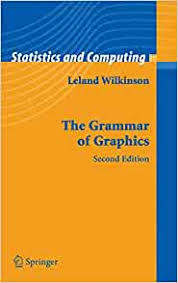

---
format:
  revealjs:
    title-slide: false   
    theme: [default, custom.scss]
    scrollable: true
    self-contained: true
    highlight-style: pygments
    code-line-numbers: true
    code-overflow: wrap
    slideNumber: true
    transition: "fade"
    progress: true
    controls: true
    ratio: 16:9
---


<!-- Custom title slide with logo and text --> 
<div style="display: flex; align-items: center; justify-content: space-between;">
<div style="flex: 0 0 40%;">
  
</div>
<div style="flex: 0 0 55%; text-align: left;">
  <h1 style="color: #153e6c; font-size: 2.8em; margin-bottom: 0.5em;">Visualizing Data</h1>
  <p style="color: #153e6c; font-size: 1.8em;">Zhaoxia Yu</p>
</div>

</div>


## Reminder

- Close all apps on your computer.  
- Open slides for this session from the COSMOS website. 


## Preparation 

1. Load package named 'ggplot2' that used for visualization

2. Load tidyverse in order to refresh data wrangling 

3. Load alzheimer_data


install/load ggplot2 and tidyverse
```{r  message=FALSE}
#| echo: true
#| code-fold: true
#install.packages('ggplot2')
library(ggplot2)

#install.packages('tidyverse')
library(tidyverse)
```

load alzheimer_data
```{r  message=FALSE}
#| echo: true
#| code-fold: true

# change the path to your personal folder path
alzheimer_data <- read.csv("../data/alzheimer_data.csv")
```


## Data 

```{r}
#| echo: true
#| code-fold: true
glimpse(alzheimer_data)
```


## ggplot


- **gg**plot is based on **g**rammar of **g**raphics.
- It is a powerful and flexible system for creating a wide range of visualizations.


```{r echo = FALSE, fig.align='center'}

```


## 3 steps of making a basic ggplot

1.Pick data

2.Map data onto aesthetics

3.Add the geometric layer


## Visualizing a Categorical Variable

Let's check the number of patients in each diagnosis group.

## Step 1: Data
```{r, fig.align='center'}
#| echo: true
#| code-fold: true
ggplot(data = alzheimer_data)
```

## Step 2: Map to Aesthetics
```{r, fig.align='center'}
#| echo: true
#| code-fold: true
ggplot(data = alzheimer_data,
       aes(x = diagnosis)) 
```

## Step 3: Add Geometric Layer with `+`
```{r, fig.align='center'}
#| echo: true
#| code-fold: true
ggplot(data = alzheimer_data,
       aes(x = diagnosis)) +
  geom_bar() 
```

## Additional Features
1. Use pipe operator to feed the data to ggplot.  

```{r, fig.align='center'}
#| echo: true
#| code-fold: true
alzheimer_data %>% 
  ggplot(aes(x = diagnosis)) +
  geom_bar() 
```


## Additional Features
2. Use `factor()` to add informative label to categorical variable (diagnosis) 

[Note: We will learn how to add labels to the axis later. Ignore `labs(), theme_minmial()` for now.]{style="font-size: 0.6em;"}

```{r, fig.align='center'}
#| echo: true
#| code-fold: true
# label diagnosis 0, 1, 2 to healthy, impaired, and Alzheimer's
alzheimer_data <- alzheimer_data %>%
  mutate(diagnosis_name = factor(diagnosis, 
                            levels = c(0, 1, 2), 
                            labels = c("Healthy", "Impaired", "Alzheimer's"))) 

alzheimer_data %>% 
  ggplot(aes(x = diagnosis_name)) +
  geom_bar() +
  labs(
    title = "Count of Diagnosis Groups",
    x = "Diagnosis Type",
    y = "Count"
  )  +  
  theme_minimal()
```

## Categorical by Categorical Variable

We can also use bar plot to visualize how the count of one categorical variable (e.g. gender) are distributed across the levels of another (e.g. diagnosis).

## Categorical by Categorical Variable
1. Stacked Bar Plot (Counts)

```{r, fig.align='center'}
#| echo: true
#| code-fold: true
# label female 0, 1 to male, female
alzheimer_data = alzheimer_data %>% 
         mutate(female = factor(
           female, 
           levels = c(0,1), 
           labels = c("Male", "Female")))
                
alzheimer_data %>%  
  ggplot(aes(x = female, fill = diagnosis_name)) +
  geom_bar(position = "stack") +
  labs(
    title = "Count of Diagnosis by Gender",
    x = "Gender",
    y = "Count",
    fill = "Diagnosis"
  ) +
  theme_minimal()
```


## Categorical by Categorical Variable
2. Grouped (Dodged) Bar Plot (Counts)
```{r, fig.align='center'}
#| echo: true
#| code-fold: true
ggplot(alzheimer_data, aes(x = female, 
                          fill = diagnosis_name)) +
  geom_bar(position = "dodge") +
  labs(
    title = "Count of Diagnosis by Gender (Grouped)",
    x = "Gender",
    y = "Count",
    fill = "Diagnosis"
  ) +
  theme_minimal()
```


## Categorical by Categorical Variable
3. Proportions (Within Groups)
```{r, fig.align='center'}
#| echo: true
#| code-fold: true
alzheimer_data %>% 
  ggplot(aes(x = female,fill = diagnosis_name)) +
  geom_bar(position = "fill") +  # Normalizes to 100% per group
  labs(
    title = "Proportion of Diagnosis by Gender",
    x = "Gender",
    y = "Proportion",
    fill = "Diagnosis"
  ) + 
  theme_minimal()
```


<!-- ## Categorical by Categorical Variable -->
<!-- 4. Standardized Proportions (Comparable Across Groups) -->
<!-- ```{r, fig.align='center'} -->
<!-- #| echo: true -->
<!-- #| code-fold: true -->
<!-- library(dplyr) -->
<!-- prop_data <- alzheimer_data %>% -->
<!--   count(female, diagnosis) %>% -->
<!--   group_by(female) %>% -->
<!--   mutate(prop = n / sum(n) * 1000)  # Standardize per 1000 -->

<!-- ggplot(prop_data, aes(x = female,  -->
<!--                      y = prop,  -->
<!--                      fill = diagnosis_name)) + -->
<!--   geom_col(position = "dodge") + -->
<!--   labs( -->
<!--     title = "Standardized Diagnosis Rates by Gender (per 1000)", -->
<!--     x = "Gender", -->
<!--     y = "Cases per 1000", -->
<!--     fill = "Diagnosis" -->
<!--   ) + -->
<!--   theme_minimal() -->
<!-- ``` -->
## Visualize a Numerical Variable

- What data type is the volume of left hippocampus (lhippo) ?
- What is the distribution of the observed volume of left hippocampus?

## Visualize a Numerical Variable: boxplot
```{r, fig.align='center'}
#| echo: true
#| code-fold: true

ggplot(data= alzheimer_data,
       mapping= aes(x= lhippo)) +
  geom_boxplot() + 
  labs(title="Boxplot of lhippo",
      x="Left Hippocampal Volume (cm³)") +  
  theme_minimal()
```

## Visualize a Numerical Variable: histogram
```{r, fig.align='center'}
#| echo: true
#| code-fold: true
ggplot(data= alzheimer_data,
       mapping= aes(x= lhippo)) +
  geom_histogram(bins = 30) +
  labs(
    title="Violin of lhippo",
    x="Left Hippocampal Volume (cm³)",
    y="Count") +  
  theme_minimal() 
```


## Visualize a Numerical Variable by a Categorical Variable
```{r, fig.align='center'}
#| echo: true
#| code-fold: true

ggplot(data = alzheimer_data,
       mapping = aes(
         x = female,  
         y = lhippo,
         fill = female)  # Optional: color by gender
       ) +
  geom_boxplot() +
  labs(
    title = "Boxplot of Left Hippocampal Volume by Gender",
    x = "Gender",
    y = "Left Hippocampal Volume (cm³)",  
    fill = "Gender"  # Legend title
  ) +
  theme_minimal()
```

 
## Visualize a Numerical Variable by a Categorical Variable
```{r, fig.align='center'}
#| echo: true
#| code-fold: true
ggplot(data = alzheimer_data,
       mapping = aes(
         x = lhippo,
         fill =female)  # Ensure 'female' is a labeled factor
       ) +
  geom_histogram(bins = 35, alpha = 0.7) +  # Adjust transparency  
  labs(
    title = "Histogram of Left Hippocampal Volume by Gender",
    x = "Left Hippocampal Volume (cm³)",  
    y = "Count",
    fill = "Gender"  # Legend title
  ) +
  theme_minimal() +
  scale_fill_manual(values = c("Male" = "skyblue", "Female" = "salmon"))  # Custom colors (optional)
```


## Visualize Numerical Variable by Numerical Variable
Will be covered in next session.


## Summary
```{r echo = FALSE, out.width ="100%", fig.align='center'}
knitr::include_graphics("img/ggplot-summary.jpeg")
```

## Practice
- Visualize lhippo by diagnosis
- Visualize lhippo by gender in healthy subjects